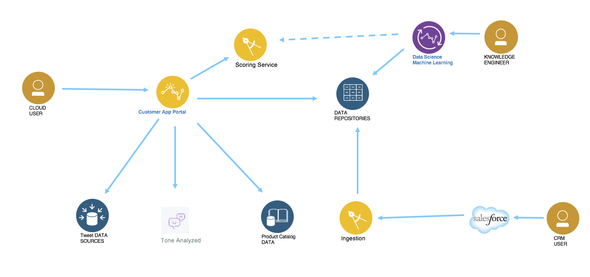

# Analytics Reference Architecture
Big data analytics (BDA) and cloud computing are a top priority for CIOs. Harnessing the value and power of big data and cloud computing can give your company a competitive advantage, spark new innovations, and increase revenue.
As cloud computing and big data technologies converge, they offer a cost-effective delivery model for cloud-based analytics.

This project provides a reference implementation for building and running analytics application deployed on hybrid cloud environment. We are focusing on offering tools and practices for Data Scientists to work efficiently and to IT architect to design hybrid analytics solution.

To get explanation of the components involved in this architecture see [Architecture Center - Analytics Architecture article](https://www.ibm.com/devops/method/content/architecture/dataAnalyticsArchitecture)

# Table of Contents
* [Data Sciences quick introduction](#data-sciences)
* [Solution overview](#solution-overview)
* [Repositories of the solution](#repositories)
* [Build and Run](#build-and-run)
* [DevOps](#devops) with [deployment](#deployment)
* [Service management](#service-management)
* [Compendium](#compendium)
* [Contribute](#contribute)

# Data Sciences Introduction
The goals for data science is to infer from data actionable insights for the business execution improvement. The main stakeholders are business users, upper managers, who want to get improvement to some important metrics and indicators to control their business goals and objectives. Data scientists have to work closely with business users and be able to explain and represent findings clearly and with good visualization, pertinent for the business users.

Data science falls into these three categories:
## Descriptive analytics
This is likely the most common type of analytics leveraged to create dashboards and reports. They describe and summarize events that have already occurred. For example, think of a grocery store owner who wants to know how items of each product were sold in all store within a region in the last five years.

## Predictive analytics
This is all about using mathematical and statistical methods to forecast future outcomes. The grocery store owner wants to understand how many products could potentially be sold in the next couple of months so that he can make a decision on inventory levels.

## Prescriptive analytics
Prescriptive analytics is used to optimize business decisions by simulating scenarios based on a set of constraints. The grocery store owner  wants to creating a staffing schedule for his employees, but to do so he will have to account for factors like availability, vacation time, number of hours of work, potential emergencies and so on (constraints) and create a schedule that works for everyone while ensuring that his business is able to function on a day to day basis.

## Some concepts
* **supervised learning**: learn a model from labeled training data that allows us to make predictions about unseen or future data. We give to the algorithm a dataset with a right answers (y), during the training, and we validate the model accuracy with a test data set with right answers. So a data set needs to be split in training and test sets.
* **unsupervised learning**: giving a dataset, try to find tendency in the data, by using techniques like clustering.
* **classification** problem is when we are trying to predict one of a small number of discrete-valued outputs
* **regression** classification problem when the goal is to predict continuous value output
* **a feature** is an attribute to use for classifying

## Challenges
There are a set of standard challenges while developing an IT solution which integrates results from analytics model. We are listing some that we want to address, document and support as requirements.
* Are we considering a scoring service or a classification one?
* Is it a batch processing to update static records or real time processing on data stream or transactional data
* How to control resource allocation for Machine Learning job.
* How to manage consistency between model and data and code: version management
* How to assess the features needed for the training and test sets.
* How to leverage real time cognitive / deep learning classification inside scoring service

## Methodology
Combining the development of analytics, machine learning and traditional software development involves adapting the agile iterative methodology. At IBM we are using the Design thinking and lean approach for developing innovative business applications. The [garage method](https://www.ibm.com/cloud/garage/) explains this approach. To support AI and analytics the method needs to be extended, focusing on data and data sciences. In [this article](./docs/methodology.md) we cover the specifics activities for analytics.

# Solution Overview
The solution needs to cover the following capabilities:
* Develop model with Data Science eXperience using static data loaded in DSX or in DB2 Warehouse
* Move data from static database to Db2 warehouse
* Integrate to different data sources in real time to get value for selected features

The system context may look like the following figure:  

* The data scientists are using IBM Data Science eXperience to collaborate on models. The data they work one are coming from DB2 warehouse
* The finalized model is implemented and deployed as a scoring service using a micro service approach
* Data may come from different data sources, customer internal database, and SaaS CRM application, tone analyzer service and tweet classifications
* A front end application is developed to interact with the user and tp consume the scoring service to assess the risk for churn
* The front end application is using a product catalog managed by a MDM, and can interact with the customer database via APIs defined in API management and supported by a data access layer micro service.

The proposed allocation of the components of this system context is still open, but we want to represent hybrid deployment and using IBM Cloud private to leverage cloud development practices for any new micro services and web application deployment.

# Repositories
The following repositories are part of the solution
* [Customer management micro service](https://github.com/ibm-cloud-architecture/refarch-integration-services) is a java based micro service to expose operations on the customer, account and purchase order resources. Packaged as docker image with Liberty server, it can be deployed on ICP. In the system context above the customer database and a data access service in front of the database.
* [Cognitive and analytics customer churn assessment](https://github.com/ibm-cloud-architecture/refarch-cognitive-analytics) using structured and unstructures data build a business application linking cognitive and analytics to learn customer's behavior and assess customer risk to churn while he/she interacts with your web site.
* [Integration tests](https://github.com/ibm-cloud-architecture/refarch-integration-tests) is a project to manage the different integration tests. In this project there are tests to validate the backend services of this solution under the src/test/java project, junit test under the package `dashdb.icp.tests`.

# Build and run
## For Data Sciences
* [Notebook explanations](notebooks/README.md)

## For customer manager
The user interface is packaged as part of the [Case Portal application](https://github.com/ibm-cloud-architecture/refarch-caseinc-app) and we [documented](docs/UI/README.md) how add the specifics customer management UI inside the portal. The backend component is a micro-service developed with JAXRS, packaged with Liberty server as a docker image.

# DevOps
## Continuous integration
## Deployment
* [Deploy Data Science eXperience (DSX) to IBM Cloud Private](docs/ICP/README.md)
* [Deploy Db2 Warehouse to IBM Cloud Private](docs/db2warehouse/README.md)

## Continuous testing

# Service management  

# Compendium
* [IBM Analytics reference architecture](https://www.ibm.com/cloud/garage/content/architecture/dataAnalyticsArchitecture/dataAnalyticsCustomerExperience)
* [Data Science Experience public page](https://datascience.ibm.com/)
* [IBM Cloud Private](https://www.ibm.com/cloud-computing/products/ibm-cloud-private/)
* [Developer works on Analytics](https://www.ibm.com/developerworks/learn/analytics/)
* Integrate with swagger https://github.com/WASdev/sample.swagger

# Contribute
We welcome your contribution. There are multiple ways to contribute: report bugs and improvement suggestion, improve documentation and contribute code.
We really value contributions and to maximize the impact of code contributions we request that any contributions follow these guidelines
* Please ensure you follow the coding standard and code formatting used throughout the existing code base
* All new features must be accompanied by associated tests
* Make sure all tests pass locally before submitting a pull request
* New pull requests should be created against the integration branch of the repository. This ensures new code is included in full stack integration tests before being merged into the master branch.
* One feature / bug fix / documentation update per pull request
* Include tests with every feature enhancement, improve tests with every bug fix
* One commit per pull request (squash your commits)
* Always pull the latest changes from upstream and rebase before creating pull request.

If you want to contribute, start by using git fork on this repository and then clone your own repository to your local workstation for development purpose. Add the up-stream repository to keep synchronized with the master.

Please [contact me](boyerje@us.ibm.com) for any questions.
