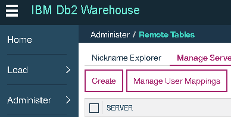
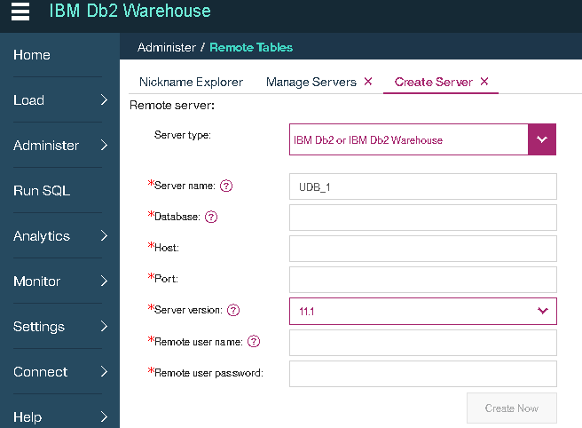
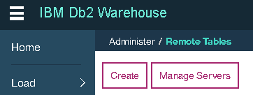
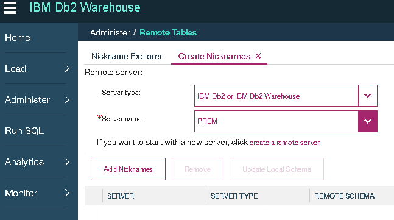
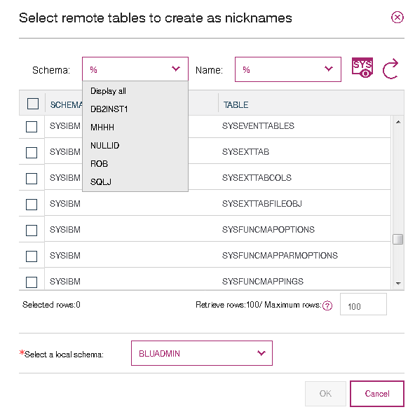
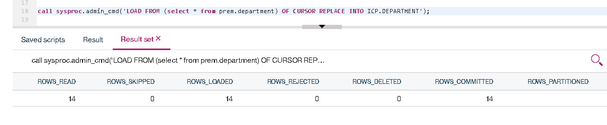

# Copying Data From DB2 to Db2 Warehouse On ICP

If you have data in a data source within your enterprise that you want to copy into a data source in ICP with minimal transformation you can use the Remote Tables feature.

## Defining the Connection

In order to directly use the data that is in another data source we have to define a connection to that data source. This is no different than defining the connection for an application, Db2 Warehouse is the application. This can be done in the Db2 Warehouse console (this is the URL [mapped to by port 8443](../db2warehouse#troubleshooting-db2), remember to use https to connect):



When you click "Create" you get something like this (I have already selected the correct Server Type):



Fill in all the details. The server name is used to reference this information later, I used PREM for this document. Once the information is entered you can select "Create Now". This may require you to move your cursor out of the Remote user password box before it can be clicked. You'll receive a success message if successful. If not you will need to troubleshoot based on the error received (this feature is also called "federation" and the most common failure is needing to [use SSL](https://www.ibm.com/support/knowledgecenter/en/SSEPGG_11.1.0/com.ibm.db2.luw.admin.sec.doc/doc/t0070301.html) which requires additional setup).

## Defining the Remote Tables

Back at the Remote Tables page there is a "Create" button. 



Clicking that will bring up a task to Create Nicknames. I have already selected my Server type and Server name ("PREM" from before).



If you click "Add Nickname" it will bring up a new dialog that lets you find tables in the remote server you want to create a local reference for:



Check the boxes of the tables you want to use. You can put them into an existing schema (BLUADMIN is selected in the picture) or write your own schema name in that box. I used "PREM". Select "OK" when ready. These remote tables are also called "nicknames".

## Using the Remote Tables

Now that you have defined the tables you are able to use them just like regular tables. These tables can be joined with other tables in your database, updated, inserted into, etc. Every time you use them there is a connection (which gets reused a number of times) to the remote data source. Any translations into the remote dialect will happen automatically. There is effort made to minimize the amount of data requested from the remote source - filtering, choosing particular columns, and grouping can be "pushed down" and happen there rather than return the intermediate results to perform those actions locally.

If there is a lot of data or you just want to keep the activity local you can make a copy. I have a nickname to a table in another instance of DB2 and want to make a copy. In this case there are only 14 rows but that remote database is not in my control and I cannot predict its availability. Maybe you want to clean the data without affecting production.

First I make an empty copy of the table locally using the "Run SQL" tool in the console:

```
create table ICP.department like PREM.department;
```

The easiest (and fastest for large datasets) is to use a "LOAD FROM CURSOR" operation selecting from the nickname and replacing the data in the local table:

```
call sysproc.admin_cmd('LOAD FROM (select * from prem.department) OF CURSOR REPLACE INTO ICP.DEPARTMENT');
```

That SYSPROC.ADMIN_CMD stored procedure allows you to run many historically command-line activities as though they were SQL. In this case I'm using the LOAD utility and am able to use shorthand to define the source file as an SQL cursor.

When the operation is done you will be able to view its results:



Now you have a copy of the data in a local table called ICP.DEPARTMENT.
