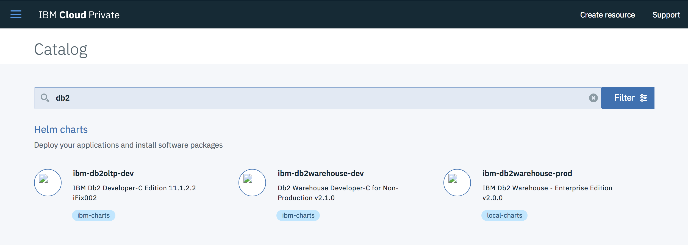
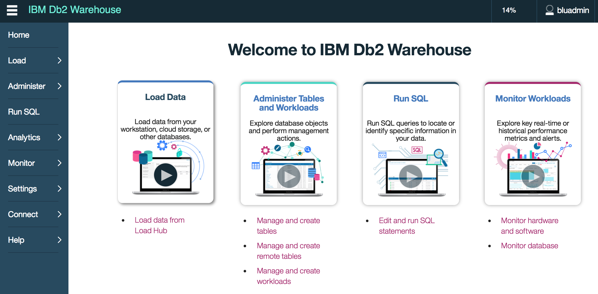
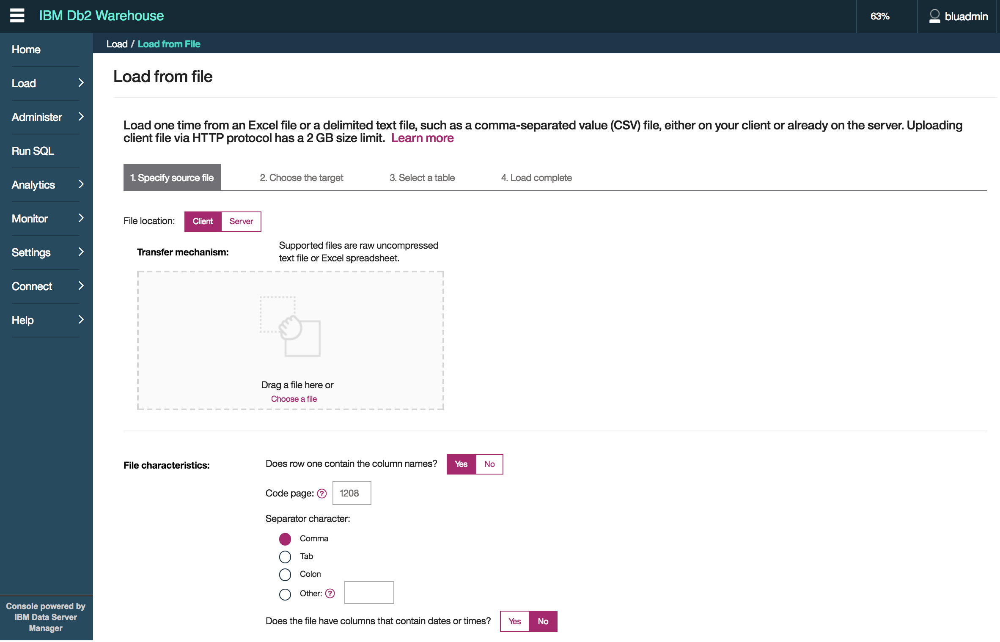
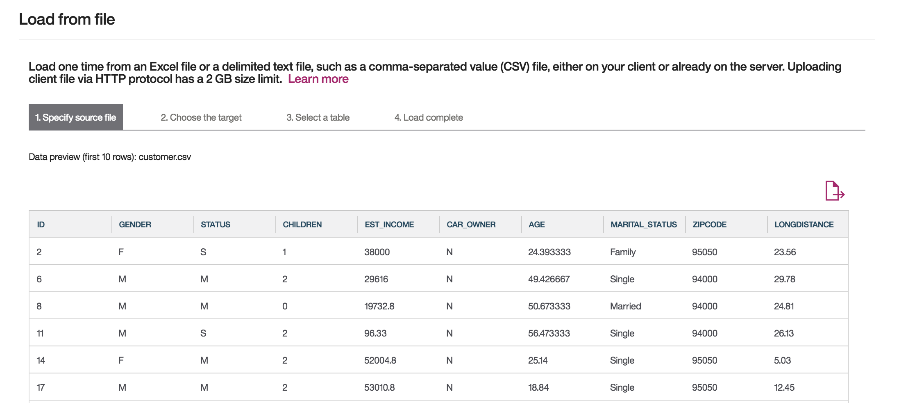
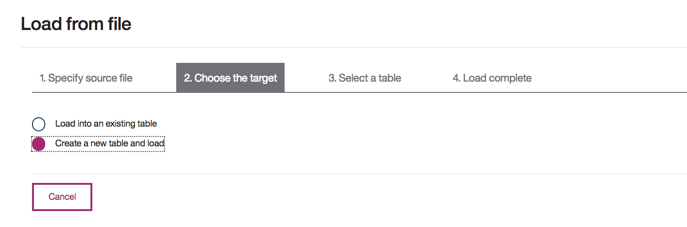
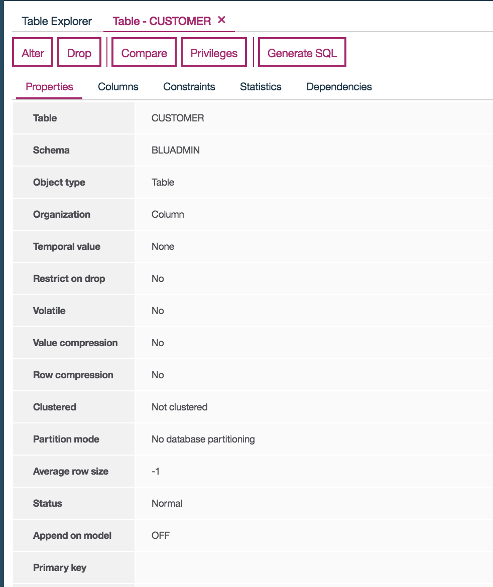

# DB2 Warehouse deployment on ICP

Db2 Warehouse is an analytics data warehouse that you deploy by using a Docker container, allowing you control over data and applications.

There are two deployment packages for [DB2 Warehouse](https://www.ibm.com/hr-en/marketplace/db2-warehouse) on ICP, development and production. We used the production deployment.

A pre-requisite for deployment is to have a persistent volume that is at least 50 GiB.

## What Type of Persistent Storage to use

We looked at two common options, NFS and [Gluster](https://www.gluster.org/). A fairly simple but repeatable workload that had an IO component was used to test performance metrics. This workload was based on the [TPC-D benchmark](http://www.tpc.org/tpcd/default.asp).

### NFS

This is the simplest storage to define. When Db2 was deployed using NFS as its persistent storage we saw the best performance with no additional tuning. For a quick, reloadable environment this is the simplest and fastest choice.

### Gluster

We used a 4-way dispersed volume with 2-brick redundancy for a total of 6 "disks". Initial deployment had performance characteristics 15-30% slower. Gluster does have the advantage of redundancy and parallelism of IO so would be recommended for longer-term database requirements in the environment.

For more information about the deployment of Gluster and the configuration we used see [High Availability Clustered Filesystems Setup](https://github.com/ibm-cloud-architecture/refarch-privatecloud/blob/master/Resiliency/Configure_HA_ICP_cluster.md#install-glusterfs)

#### Turbo-Charging Gluster

Since part of Gluster's advantage is dispersed IO and redundancy we made a simple change to how data was stored in DB2 that added another parallelization layer. Knowing that the gluster file system consisted of 6 bricks we created a new storage group to have 6 containers and tablespaces to use that storage group. We used `select db_storage_path from table(admin_get_storage_paths('',-1)) where storage_group_name = 'IBMSTOGROUP'` to find the path used by the deployment.

```
create stogroup sto6 on '/path', '/path', '/path', '/path', '/path', '/path';
create tablespace data1 automatic using stogroup sto6;
```

All tables would then be created in the data1 tablespace.

Alternatively you can run `alter stogroup ibmstogroup add '/path', '/path', '/path', '/path', '/path'` to modify the default storage group and all tables created afterward would then have the same IO characteristics.

Performance testing done with this new storage group were identical to NFS performance statistics.

## Deploy DB2 chart to ICP
As an ICP administrator user, select from the catalog the  'ibm-db2warehouse-prod' chart for your production deployment.



Then in the configuration settings be sure to specify the persistent volume claim created previously.

## Useful articles
* https://github.ibm.com/IBMPrivateCloud/charts/tree/master/stable/ibm-db2warehouse-prod
* For more information about Db2 Warehouse, see the IBM Db2 Warehouse documentation. (https://www.ibm.com/support/knowledgecenter/SS6NHC/com.ibm.swg.im.dashdb.kc.doc/welcome.html)


## Troubleshooting DB2
From the ICP admin console try to see the DB2 deployment and then the pod name.
With `helm list` you can see the deployed ibm-db2-warehouse-prod release(s).

The release detailed status:
```
$ helm status <deployment name>

LAST DEPLOYED: Mon Dec 11 10:34:06 2017
NAMESPACE: db2-warehouse
STATUS: DEPLOYED

RESOURCES:
==> v1/PersistentVolumeClaim
NAME                                    STATUS  VOLUME             CAPACITY  ACCESSMODES  STORAGECLASS  AGE
db2-gc-ibm-db2warehouse-prod-pvc1  Bound   db2wh-pv-hostpath  50Gi      RWO          17m

==> v1/Service
NAME                               CLUSTER-IP  EXTERNAL-IP  PORT(S)                                         AGE
db2-gc-ibm-db2warehouse-prod  10.0.0.16   <nodes>      50000:32166/TCP,50001:31560/TCP,8443:31107/TCP  17m

==> v1beta1/Deployment
NAME                               DESIRED  CURRENT  UP-TO-DATE  AVAILABLE  AGE
db2-gc-ibm-db2warehouse-prod  1        1        1           1          17m


NOTES:
Get the database URL by running these commands:
  export NODE_PORT=$(kubectl get --namespace db2-warehouse -o jsonpath="{.spec.ports[0].nodePort}" services db2-gc-ibm-db2warehouse-prod)
  export NODE_IP=$(kubectl get nodes --namespace db2-warehouse -o jsonpath="{.items[0].status.addresses[0].address}")
  echo jdbc:db2://$NODE_IP:$NODE_PORT/bludb:user=<>;password="<>"
```

The port number mappings are important to build the URL to access the Console, see how the 8443 internal port is mapped to 31107 external port. The url uses the proxy IP address and becomes something like https://172.16.40.131:31107. The admin user is `bluadmin`

The following kubectl will give the information of the pod as well.
```
$ kubectl get pods --namespace db2-warehouse
NAME                                         READY     STATUS    RESTARTS   AGE
db2-ibm-db2warehouse-prod-3772094781-3z4m3   1/1       Running   0          35m

$ kubectl describe pod db2-ibm-db2warehouse-prod-3772094781-3z4m3 --namespace db2-warehouse
```

As of now 12/2017 the logs in ICP do not have information on DB2 state, so to access the db2 logs we need to connect to the pod:
```
# kubectl exec -it <pod name> bash
$ kubectl exec -it db2-ibm-db2warehouse-prod-3772094781-3z4m3 bash --namespace db2-warehouse
$ tail -f /var/log/dashdb_local.log
```

If you need to assess id DB2 is running use: `ps -ef | grep db2sysc` inside the pod.


## Loading customer sample data
To be sure database is up and running we can use the Load data from file wizard. From the Db2 main paged accessed via a URL like https://172.16.40.131:31107/console



go to Load > Load from file, and select the customer.csv file from [the cognitive analytics project] (https://github.com/ibm-cloud-architecture/refarch-cognitive-analytics) under the `data` folder. Be sure to specify that the first row is including a table header and the separator is a comma.



The next step displays the 10 first rows of the loaded file



Then create a specific new table, as there is no Customer table yet in the database:



Finally when the table is created and data loaded it is possible to use the table explorer to look at the table meta data, and data records:



### Accessing the data from Java client
The kubectl command can help you identifying the jdbc setting to use to access the database from a Java Client like the Eclipse Database Development perspective.

```
$ kubectl get service --namespace db2-warehouse
$ export NODE_PORT=$(kubectl get --namespace db2-warehouse -o jsonpath="{.spec.ports[0].nodePort}" services db2-gc-ibm-db2warehouse-prod)
$ export NODE_IP=$(kubectl get nodes --namespace db2-warehouse -o jsonpath="{.items[0].status.addresses[0].address}")

$ echo jdbc:db2://$NODE_IP:$NODE_PORT/bludb:user=<>;password="<>"

```
## Backing Up Databases

A Db2 Warehouse deployment comes with a database named BLUDB and an alias to this database named METADB. BLUDB has important metadata and any custom data. This is the database exposed by the DB2 console, or Data Server Manager (DSM). The simplest way to run a backup is to use the ADMIN_CMD stored procedure. The most robust method is to use the command line and run a traditional BACKUP DATABASE command. Both require some additional non-obvious steps.

### Using ADMIN_CMD

The full syntax of a backup using ADMIN_CMD is available [in the Knowledge Center](https://www.ibm.com/support/knowledgecenter/en/SSEPGG_11.1.0/com.ibm.db2.luw.sql.rtn.doc/doc/r0023569.html). At a minimum the command will look like `CALL SYSPROC.ADMIN_CMD('backup database BLUDB ONLINE INCLUDE LOGS')`. This will cause backup files to be created in a default location (`/mnt/bludata0/db2/log/`). **NOTE**: These files are inside the container and are lost if the container is lost. 

This method is useful when preparing for a big change that may need to be rolled back. See the additional steps required in the next section if you want to back up data for disaster recovery or duplicate deployment reasons, remembering you must restore from a command line.

### From the Command Line

Using the instructions from [Troubleshooting DB2](#troubleshooting-db2) you can find the namespace and pod name as well as how to get a bash shell inside the pod. Once you have a shell you will be connected as root so should issue `su - db2inst1` to get a command prompt as the instance owner. The shell environment isn't completely set up for us so we will need to use the full path to binaries for some commands.

#### Export the Encryption Key

Your database is encrypted using DB2 Native Encryption. If the database will be restored to any other environment or pod this key will be needed, including in the case of needing a new pod due to a disaster recovery. First we need to know what label is currently in use by the database:

```
db2 connect to bludb
db2 -x "select master_key_label from table(sysproc.admin_get_encryption_info());"
```

This will result in output similar to:

```
DB2_SYSGEN_db2inst1_BLUDB_2018-01-18-18.06.37_99807F2D
```

That is your key label and is used to export the appropriate item from the keystore using the full path to the binaries so the proper gskit libraries are referenced:

```
/mnt/blumeta0/home/db2inst1/sqllib/gskit/bin/gsk8capicmd_64 -cert -export -db /mnt/blumeta0/db2/keystore/keystore.p12 -stashed -label DB2_SYSGEN_db2inst1_BLUDB_2018-01-18-18.06.37_99807F2D -target /mnt/blumeta0/scratch/db2inst1/bludb.key
```

**NOTE** The `/mnt/blumeta0/scratch/db2inst1/bludb.key` is not password-protected and does contain the encryption key that would allow your database to be restored elsewhere. Take appropriate precautions when storing or moving it.

#### Create a Backup

Still inside the pod and as the user db2inst1 issue the command `db2 backup db bludb online to /mnt/blumeta0/scratch/db2inst1/ INCLUDE LOGS`. This will result in output similar to:

```

Backup successful. The timestamp for this backup image is : 20180123202512

```

There will also be files in `/mnt/blumeta0/scratch/db2inst1/` named as `BLUDB.0.db2inst1.DBPART000.20180123202512.001` (and perhaps .002, .003, etc). These are all needed to restore your database. The naming convention is `database name`.`logical partition number`.`instance name`.`partition number`.`timestamp`.`part`. Usually only the timestamp portion changes and will always match the output from the backup command, which is in YYYYMMDDHHMMSS format.

#### Copy Files Outside the Pod

In order to have these files outside the environment you have to first copy them. This can be done directly from the pod to any remotely-mounted filesystem that would be used by an automated backup and retention database. **NOTE** It is best practice to keep the encryption key file separate from the backup image. These instructions do not do that. 

For each file you need to copy run the `kubectl cp` command from outside the pod:

```
kubectl cp <namespace>/<pod>:/mnt/blumeta0/scratch/db2inst1/<file> ./<file>
```

To break that down you need the namespace (db2-warehouse in the examples), the pod name (db2-ibm-db2warehouse-prod-3772094781-3z4m3), the full path in the pod to the file you want (/mnt/blumeta0/scratch/db2inst1/bludb.key) and a name for the target file (./bludb.key), a directory target does not work. Repeat this for all parts of the backup, remembering to put those files somewhere different from the extracted key.

If you did not specify a directory target or you don't remember your directory target you can find it by querying the `DB_HISTORY` view with a query such as `select start_time, location from sysibmadm.db_history where operation = 'B' order by start_time desc`. You will get an entry for each backup file created and your start time will be the same as the backup timestamp.

## Restoring Databases

Whether disaster has struck, you're undoing a deployment, or someone's cat walked on their keyboard you may need to restore the database you just backed up. To perform a restore in this environment you will need the database backup files. If your container was lost and you are restoring to a different one you will also need your exported encryption key that goes with that backup. If you are restoring "in place" - your source and destination pod are the same - some of these steps are not needed.

#### Copy Files Into the Pod

(Source and Destination don't match OR desired backup files are not in the current pod.) Similar to copying out backup files you need to make these available as a local resource. Copy each backup file (`DB.0.db2inst1.DBPART000.YYYYMMDDHHMMSS.###`) and the exported key (only needed if this is a different pod than the backup was taken from).

```
kubectl cp ./<file> <namespace>/<pod>:/mnt/blumeta0/scratch/db2inst1/<file>
```

You cannot use globs (`*`, `?`, etc) or copy a directory at a time. You can tar things up, copy that, and untar it inside the pod.

#### Import Exported Key

(Source and Destination don't match OR you did something to the keystore OR you received errors related to encryption while performing the restore.) Db2 Warehouse uses system-generated keys to encrypt the database. You can also manually rotate these keys if policy requires it. Db2 will rotate the key after a restore. This import must be done as db2inst1 while inside the pod.

```
/mnt/blumeta0/home/db2inst1/sqllib/gskit/bin/gsk8capicmd_64 -cert -import -db /mnt/blumeta0/scratch/db2inst1/bludb.key -target /mnt/blumeta0/db2/keystore/keystore.p12 -target_stashed
```

#### Performing the Database Restore

An encrypted database must be restored in a few steps. All are run as db2inst1 inside the pod.  

##### Drop the Existing Database

You cannot do a restore/replace with an encrypted database. Dropping the database requires exclusive access. Depending what's going on you could have the database console and external applications connected to the database. The listed sequence of commands will almost always work but ... there are a lot of resources on the Internet for how to get exclusive access to a Db2 database because it can be tricky. You can help yourself out by first stopping the DSM server with `/opt/ibm/dsserver/bin/stop.sh`.  

```
db2 connect to bludb
db2 quiesce database immediate
db2 terminate
db2 force applications all
db2 connect to bludb
db2 unquiesce database
db2 terminate
db2 drop database bludb
```

If your database is still not dropped you can try this trick:  

```
db2 catalog db bludb as bludb2
db2 uncatalog db bludb
```

Now retry the previous steps but use bludb2 as your database name.

##### Issuing the Restore

Now that the database is gone it can be restored. Note that I am running this from the `/mnt/blumeta0/scratch/db2inst1` directory and there is only one backup image. Otherwise you can provide the `FROM` and `TAKEN AT` clauses to identify file location and backup time.

```
db2 restore database bludb logtarget /mnt/blumeta0/scratch/db2inst1 encrypt
db2 "rollforward db bludb to end of backup and complete overflow log path (/mnt/blumeta0/scratch/db2inst1)"
```

The backup command had `INCLUDE LOGS` in it and we want to be able to roll forward through those logs so they have to be extracted during the restore. The rollforward command is completing any transactions that were occurring during the backup and putting the database into a consistent state.

That's it! You have a restored database. You can restart DSM with `/opt/ibm/dsserver/bin/start.sh`.
