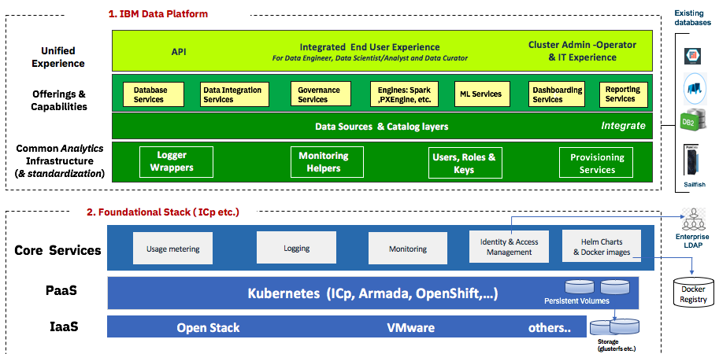
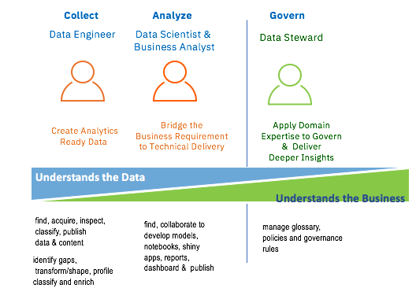

# ICP for Data Compendium
This note is to group knowledge sharing notes on [ICP for Data](https://www.ibm.com/analytics/cloud-private-for-data/).

## Key positioning
*ICP for Data is a solution for doing data science, data engineering, and app building with no assembly required.*
* Make data simple and accessible for AI work
* Support hybrid cloud data management
* Unified data governance
* Organize data into a trusted source of truth

## Features
Based on IBM Cloud private, and adds:
* database service
* data integration service
* governance
* analytics engine
* Machine learning services...

* Connect to a data source (Hadoop Distributed File System or DB2 warehouse on the same ICP supported)
* Virtualize data:  bridge data across multiple data sources without having to create a whole new integrated physical data platform
* Model management
* Data catalog

## Persona
* Data engineers
* Data Stewards
* Data Scientists
* Business Analysts

## Demo scripts

## Deploy on ICP

## Further Readings
*  Presents important questions to assess when developing a microservice related to data management, and the seven most important considerations.
