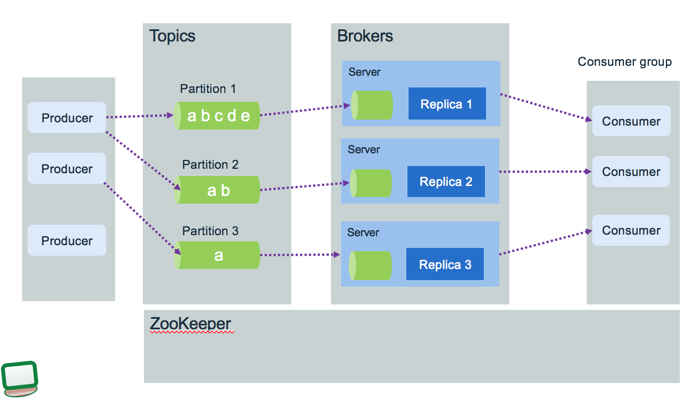
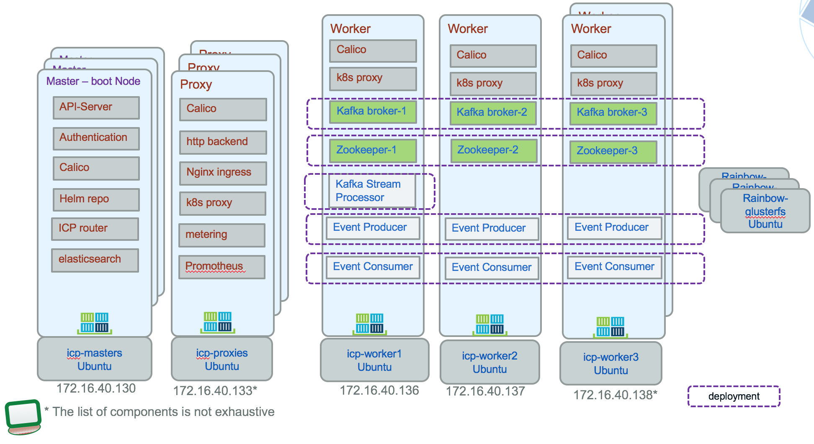
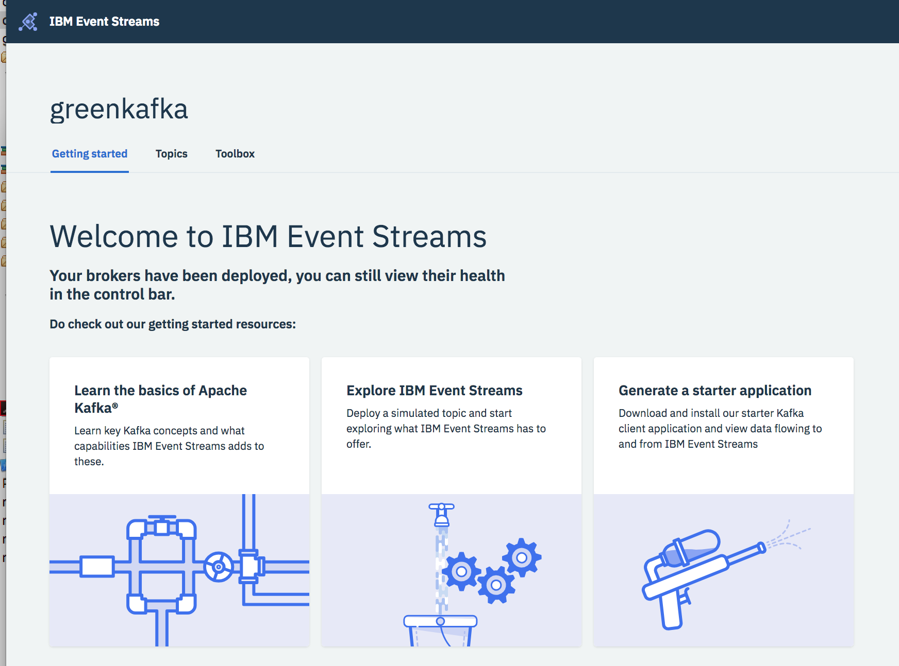

# Apache Kafka
[Kafka](https://kafka.apache.org/) is a distributed streaming platform. It has three key capabilities:
* Publish and subscribe streams of records, similar to a message queue or enterprise messaging system.
* Store streams of data records on disk and replicate within the cluster for fault-tolerance.
* It is built on top of the ZooKeeper synchronization service to keep topic, partition and offsets states
* Process streams of records as they occur.



The diagram above shows brokers allocated on three servers, partitions used by producer and consumers and data replication. Zookeeper runs also in cluster. Before going into the details of this architecture we want to summarize the key concepts.

## Key concepts
* Kafka runs as a cluster of one or more **broker** servers that can, in theory, span multiple data centers.
* The Kafka cluster stores streams of records in **topics**. Topic is referenced by producer to send data too, and subscribed by consumers.
* Each broker may have zero or more partitions per topic.
* Each partition is ordered immutable sequence of records, that are persisted for a long time period.
* Each record consists of a key, a value, and a timestamp.
* Producers publish data records to topic and consumers subscribe to topics. When a record is produced without specifying a partition, a partition will be chosen using a hash of the key. If the record did not provide a timestamp, the producer will stamp the record with its current time (creation time or log append time). They hold a pool of buffer to keep records not yet transmitted to the server.
* Each partition is replicated across a configurable number of servers for fault tolerance. The number of partition will depend on the number of consumer, the traffic pattern
* Each partitioned message has a unique sequence id called **offset** ("abcde, ab, a ..." are offsets).
* Offsets are maintained in Zookeeper, so consumers can read next message (or from a specific offset) correctly even during broker server outrages.
* Kafka uses topics with a pub/sub combined with queue model: it uses the concept of consumer group to divide the processing over a collection of consumer processes, and message can be broadcasted to multiple groups.
* Zookeeper is used to keep cluster state, notify consumers and producers for new or failed broker
* Stream processing is helpful for handling out-of-order data, *reprocessing* input as code changes, and performing stateful computations. It uses producer / consumer, stateful storage and consumer groups. It treats both past and future data the same way.
* Consumer performs asynchronous pull to the connected broker via the subscription to a topic.

###  Use cases
* Aggregation of event coming from multiple producers.
* Monitor distributed applications to produce centralized feed of operational data.
* Logs collector from multiple services


### Kafka Stream Details
I recommend reading this excellent introduction from Jay Kreps @confluent: [Kafka stream made simple](https://www.confluent.io/blog/introducing-kafka-streams-stream-processing-made-simple/) to get familiar of why Kafka stream.

Kafka Stream has the following capabilities:
* embedded library for your application to use
* integrate tables of state with streams of events
* consume continuous real time flow of records and publish new flow
* It supports exactly-once processing semantics to guarantee that each record will be processed once and only once even when there is a failure
* Stream APIs transform, aggregate and enrich data, per record with milli second latency, from one topic to another one.
* Support stateful and windowing operations by processing one record at a time.
* Can be integrated in java application and micro service. No need for separate processing cluster. It is a Java API. Stream app is done outside of the broker code!.
* Elastic, highly scalable, fault tolerance, it can recover from failure
* Deploy as container to kubernetes or other orchestration platform

From a component view kafka streaming application looks like:

Kafka stream should be your future platform for asynchronous communication between your microservices to simplify interdependencies between them.

### Architecture


* Kafka Streams partitions data for processing it. Partition enables data locality, elasticity, scalability, high performance, and fault tolerance
* The keys of data records determine the partitioning of data in both Kafka and Kafka Streams
* An application's processor topology is scaled by breaking it into multiple tasks.
* Tasks can then instantiate their own processor topology based on the assigned partitions

When developing a record producer you need to assess the following:
* what is the expected throughput to send events? Event size * average throughput combined with the expected latency help to compute buffer size.
* can the producer batch events together to send them in batch over one send operation See
* is there a risk for loosing communication? Tune the RETRIES_CONFIG and buffer size
* assess once to exactly once delivery requirement. Look at idempotent producer.

Then from the consumer point of view a set of items need to be addressed during design phase:
* do you need to group consumers for parallel consumption of events
* what is the processing done once the record is processed out of the topic. and how a record is supposed to be consumed.
* how to persist consumer committed position (the last offset that has been stored securely)
* assess if offsets need to be persisted outside of kafka - zookeeper, for example to keep offset and data together in a unique persistence layer, to implement a strong consume exactly once.
* does record time sensitive, and it is possible that consumers fall behind, so when a consumer restarts he can bypass missed records
* do the consumer needs to perform joins, aggregations between multiple partitions?


### High Availability in the context of Kubernetes deployment
For any Kubernetes deployment real high availability is constrained by the application / workload deployed on it. The kubernetes platform supports high availability by having at least the following configuration:
* At least three master nodes (always a odd number). One is active at master, the others are in standby.
* Three proxy nodes.
* At least three worker nodes
* Externalize the management stack to three manager nodes
* Shared storage outside of the cluster to support private image registry, audit logs
* Use Etcd cluster: See recommendations [from here](https://github.com/coreos/etcd/blob/master/Documentation/op-guide/clustering.md). The virtual IP manager assign virtual IP address to master and proxy nodes and monitors the health of the cluster. It leverages ETCD for storing information, so it is important that etcd is high available.  
For IBM Cloud private HA installation see the [product documentation](https://www.ibm.com/support/knowledgecenter/en/SSBS6K_2.1.0.3/installing/custom_install.html#HA)

Traditionally disaster recovery and high availability were always consider separated subjects. Now active/active deployment where workloads are deployed in different data center, are more a common request. IBM Cloud Private is supporting [federation cross data centers](https://github.com/ibm-cloud-architecture/refarch-privatecloud/blob/master/Resiliency/Federating_ICP_clusters.md), but you need to ensure to have low latency network connections. Also not all deployment components of a solution are well suited for cross data center clustering.

In Kafka context, the **Confluent** web site presents an interesting article for [kafka production deployment](https://docs.confluent.io/current/kafka/deployment.html). One of their recommendation is to avoid cluster that span multiple data centers and specially long distance ones. But the semantic of the event processing may authorize some adaptations. For sure you need multiple Kafka Brokers, which will connect to the same ZooKeeper ensemble running at least three nodes.

When deploying Kafka within kubernetes cluster the following diagram illustrates a minimum HA topology with three node for kafka and three for zookeeper:


This schema illustrates the recommendation to separate Zookeeper from Kafka nodes for failover purpose as zookeeper keeps state of the kafka cluster. Kafka uses the log.dirs property to configure the driver to persist logs. So you need to define multiple volumes/ drives to support log.dirs.

Zookeeper should not be used by other systems.

For configuring ICP for HA on VmWare read [this note](https://github.com/ibm-cloud-architecture/refarch-privatecloud/blob/master/Configuring_ICP_for_HA_on_VMware.md).

For Kafka streaming with stateful processing like joins, event aggregation and correlation coming from multiple partitions, it is not easy to achieve high availability cross clusters: in the strictest case every event must be processed by the streaming service exactly once. Which means:
* producer emit data to different sites and be able to re-emit in case of failure. Brokers are known by producer via a list of hostname and port number.
* communications between zookeeper and cluster node are redundant and safe for data losses
* consumer ensures idempotence... They have to tolerate data duplication and manage data integrity in their persistence layer.

Within kafka's boundary, data will not be lost, when doing proper configuration, also to support high availability the complexity moves to the producer and the consumer implementation .

Kafka configuration is an art and you need to tune the parameters by use case:
* partition replication for at least 3 replicas. Recall that in case of node failure,  coordination of partition re-assignments is provided with ZooKeeper.
* end to end latency needs to be measured from producer (when a message is sent) to consumer when it is read. A consumer is able to get a message when the broker finishes to replicate to all in-synch replicas.
* use the producer buffering capability to pace the message to the broker. Can use memory or time based threshold.
* Define the number of partitions to drive consumer parallelism. More consumers running in parallel the higher is the throughtput.
* Assess the retention hours to control when old messages in topic can be deleted
* Control the maximum message size the server can receive.    

## Run Kafka in Docker
### On Linux
If you run on a linux operating system, you can use the [Spotify kafka image](https://hub.docker.com/r/spotify/kafka/) from dockerhub as it includes [Zookeeper]() and Kafka in a single image.

It is started in background (-d), named "kafka" and mounting scripts/kafka folder to /scripts
```
docker run -d -p 2181:2181 -p 9092:9092 -v `pwd`:/scripts --env ADVERTISED_HOST=`docker-machine ip \`docker-machine active\`` --name kafka --env ADVERTISED_PORT=9092 spotify/kafka
```

Then remote connect to the docker container to open a bash shell:
```
docker exec  -ti kafka /bin/bash
```

Create a topic: it uses zookeeper as a backend to persist partition within the topic.

```
cd /opt/kafka/bin
./kafka-topics.sh --create --zookeeper localhost:2181 --replication-factor 1 --partitions 1 --topic mytopic
./kafka-topics.sh --list --zookeeper localhost:2181
```
We have done shell scripts for you to do those command and test your local kafka and then the kafka deployed on ICP. The scripts are under ../scripts/kafka
* createtopic.sh
* listtopic.sh
* sendText.sh  Send a multiple lines message on mytopic topic- open this one in one terminal.
* consumeMessage.sh  Connect to the topic to get messages. and this second in another terminal.

### On MacOS with Docker
Go to the `scripts/kafka` folder and start a 4 docker containers solution with Kafka, ZooKeeper, REST api, and schema registry using `docker-compose up` command. The images are from [confluent](https://github.com/confluentinc/)
```
REPOSITORY                         TAG                 IMAGE ID            CREATED             SIZE
confluentinc/cp-schema-registry    latest              31837a7d646d        6 days ago          673MB
confluentinc/cp-kafka-rest         latest              4b878c9e48f0        6 days ago          663MB
confluentinc/cp-kafka              latest              c3a2f8363de5        6 days ago          562MB
confluentinc/cp-zookeeper          latest              18b57832a1e2        6 days ago          562MB
```

### On MacOS with Docker Edge and Kubernetes
This deployment is using the last Docker Edge version which include kubernetes simple cluster.

The folder scripts/kafka include a set of yaml files to configure zookeeper and kafka:
```
# Create the zookeeper single node (one replica) exposing port 2181
kubectl create -f zookeeper-deployment.yaml
# expose zokeeper with a nodeport service on port 30181 mapped to docker image port 2181
kubectl create -f zookeeper-service.yaml
```
Modify the kafka deployment yaml file to change the IP addresses set with your ip address.
```
- name: KAFKA_ADVERTISED_HOST_NAME
         value: "192.168.1.89"
- name: KAFKA_ZOOKEEPER_CONNECT
         value: 192.168.1.89:30181
```
Then create the kafka deployment:
```
$ kubectl create -f kafka-deployment.yaml
# and the service to export a nodeport 30092
$ kubectl create -f kafka-service.yaml
```

So now we can test with a tool like: `kafkacat`, that you can install with `brew install kafkacat`. To consume message use a terminal window and listen to the `test-topic` with `kafkacat -C -b 192.168.1.89:30092 -t test-topic`. To produce text message use a command like:
```
 echo "I'm a super interesting message" | kafkacat -P -b 192.168.1.89:30092 -t test-topic
```

```
kubectl get pods
NAME                         READY     STATUS    RESTARTS   AGE
kafka-786975b994-cwqhs       1/1       Running   0          20m
zookeeper-58759999cc-ff8fq   1/1       Running   0          55m
```

To work on topic, connect to the kafka container and use the same tools as before but specify the zookeeper running in a separate container.
```
docker exec -ti <kafka-container-id> bash
bash-4.4# cd /opt/kafka/bin
bash-4.4# ./kafka-topics.sh --list --zookeeper 192.168.1.89:30181
 ./kafka-topics.sh --create --replication-factor 1 --partitions 1 --topic streams-wordcount-output --zookeeper 192.168.1.89:30181
```

Kafka web site has an interesting use case to count words within a text, we will detail that in [this section](#example-to-run-the-word-count-application:).

We are also detailing a full solution including Event producer, consumer and persistence to Cassandra in [this repository](https://github.com/ibm-cloud-architecture/refarch-asset-analytics)

## Install on ICP
*(Tested on May 2018 on ibm-eventstreams-dev helm chart 0.1.1 of 5/24 on ICP 2.1.0.3)*

You can use the `ibm-eventstreams-dev` Helm chart from ICP catalog the instructions can be found [here](https://developer.ibm.com/messaging/event-streams/docs/install-guide/).  
You need to decide if persistence should be enabled for ZooKeeper and Kafka broker. Allocate one PV per broker and ZooKeeper server or use dynamic provisioning but ensure expected volumes are present.

For the release name take care to do not use a too long name as there is an issue on name length limited to 63 characters.

The screen shots below presents the release deployment results:

This figure above illustrates the following:
* ConfigMap for UI, kafka proxy, kafka REST api proxy.
* The three deployment for each major components: UI, REST and controller.


The roles, rolebinding and secret as part of the Role Based Access Control.


The service to expose capabilities to external world via nodePort type:
* admin console port 32492 on the k8s proxy IP address
* REST api port 30031
* stream proxy port bootstrap: 31348, broker 0: 32489...

To get access to the Admin console by using the IP address of the master proxy node and the port number of the service, which you can get using the kubectl get service information command like:
```
kubectl get svc -n greencompute "greenkafka-ibm-eventstreams-admin-ui-proxy-svc" -o 'jsonpath={.spec.ports[?(@.name=="admin-ui-https")].nodePort}'

```



Use the Event Stream Toolbox to download a getting started application. One example of the generated app is in the IBMEventStreams_GreenKafkaTest folder, and a description on how to run it is in the [readme](../../IBMEventStreams_GreenKafkaTest/README.md)

The application runs in Liberty at the URL: http://localhost:9080/GreenKafkaTest/ and delivers a nice simple interface   

to test the producer and consumer of text message:

  


  

The following project: [asset analytics](https://github.com/ibm-cloud-architecture/refarch-asset-analytics) goes deeper in stream application implementation.

## Verifying ICP Kafka installation
Once connected to the cluster with kubectl with commands like:
```
kubectl config set-cluster cluster.local --server=https://172.16.40.130:8001 --insecure-skip-tls-verify=true
kubectl config set-context cluster.local-context --cluster=cluster.local
kubectl config set-credentials admin --token=e.......
kubectl config set-context cluster.local-context --user=admin --namespace=greencompute
kubectl config use-context cluster.local-context
```
Get the list of pods for the namespace you used to install kafka / event streams:
```
$ kubectl get pods -n greencompute
NAME                                                              READY     STATUS    RESTARTS   AGE
greenkafka-ibm-eventstreams-kafka-sts-0                           1/2       Running   32         1d
greenkafka-ibm-eventstreams-kafka-sts-1                           2/2       Running   10         1d
greenkafka-ibm-eventstreams-kafka-sts-2                           2/2       Running   18         1d
greenkafka-ibm-eventstreams-proxy-controller-deploy-6f6796jlzcz   1/1       Running   0          1d
greenkafka-ibm-eventstreams-rest-deploy-54b6d4cbb8-hjnxx          3/3       Running   0          1d
greenkafka-ibm-eventstreams-ui-deploy-68d5488cf7-gn48n            3/3       Running   0          1d
greenkafka-ibm-eventstreams-zookeeper-sts-0                       1/1       Running   0          1d
greenkafka-ibm-eventstreams-zookeeper-sts-1                       1/1       Running   0          1d
greenkafka-ibm-eventstreams-zookeeper-sts-2                       1/1       Running   0          1d
```

Select the first pod: greenkafka-ibm-eventstreams-kafka-sts-0, then execute a bash shell so you can access the kafka tools:
```
$ kubectl exec greenkafka-ibm-eventstreams-kafka-sts-0 -itn greencompute -- bash
bash-3.4# cd /opt/kafka/bin
```
Now you have access to the same tools as above. The most important thing is to get the hostname and port number of the zookeeper server. To do so use the kubectl command:
```
$ kubectl describe pods greenkafka-ibm-eventstreams-zookeeper-sts-0 --namespace greencompute
```
In the long result get the client port ( ZK_CLIENT_PORT: 2181) information and IP address (IP: 192.168.76.235). Using these information, in the bash in the broker server we can do the following command to get the topics configured.

```
./kafka-topics.sh --list -zookeeper  192.168.76.235:2181
```


### Using the Event Stream CLI
If not done before you can install the Event Stream CLI on top of ICP CLI by first downloading it from the Event Stream console and then running this command:
```
bx plugin install ./es-plugin
```
From there is a quick summary of the possible commands:
```
# Connect to the cluster
bx es init

# create a topic  - default is 3 replicas
bx es topic-create streams-plaintext-input
bx es topic-create streams-wordcount-output --replication-factor 1 --partitions 1

# list topics
bx es topics

# delete topic
bx es topic-delete streams-plaintext-input
```

### Troubleshooting
#### For ICP see this centralized [note](https://github.com/ibm-cloud-architecture/refarch-integration/blob/master/docs/icp/troubleshooting.md)

#### For Kafka:
Assess the list of Topics
```
# remote connect to the kafka pod and open a bash:
$ kubectl exec -ti kafka-786975b994-9m8n2 bash
bash-4.4# ./kafka-topics.sh  --zookeeper 192.168.1.89:30181 --list
```
Purge a topic with bad message: delete and recreate it
```
./kafka-topics.sh  --zookeeper 192.168.1.89:30181 --delete --topic test-topic
./kafka-topics.sh  --zookeeper 192.168.1.89:30181 --create --replication-factor 1 --partitions 1 --topic test-topic
```

## Streaming app
The Java code in the project: https://github.com/ibm-cloud-architecture/refarch-asset-analytics/tree/master/asset-event-producer includes examples of stateless consumers, a text producer, and some example of stateful operations. In general code for processing event does the following:
* Set a properties object to specify which brokers to connect to and what kind of serialization to use.
* Define a stream client: if you want stream of record use KStream, if you want a changelog with the last value of a given key use KTable (Example of using KTable is to keep a user profile with userid as key)
* Create a topology of input source and sink target and action to perform on the records
* Start the stream client to consume records

A stateful operator uses the streaming Domain Specific Language, and is used for aggregation, join and time window operators. Stateful transformations require a state store associated with the stream processor. The code below comes from Kafka examples and is counting word occurence in text
```
    final StreamsBuilder builder = new StreamsBuilder();
    final Pattern pattern = Pattern.compile("\\W+");

    KStream<String, String> textLines = builder.stream(source);

    KTable<String, Long> wordCounts = textLines
       .flatMapValues(textLine -> Arrays.asList(pattern.split(textLine.toLowerCase())))
       .print(Printed.toSysOut()
       .groupBy((key, word) -> word)
       .count(Materialized.<String, Long, KeyValueStore<Bytes, byte[]>>as("counts-store"));
    wordCounts.toStream().to(sink, Produced.with(Serdes.String(), Serdes.Long()));

    KafkaStreams streams = new KafkaStreams(builder.build(), props);
    streams.start();
```
* [KStream](https://kafka.apache.org/10/javadoc/org/apache/kafka/streams/kstream/KStream.html) represents KeyValue records coming as event stream from the topic.
* flatMapValues() transforms the value of each record in "this" stream into zero or more values with the same key in the new KStream. So here the text line is split into words. The parameter is a [ValueMapper](https://kafka.apache.org/10/javadoc/org/apache/kafka/streams/kstream/ValueMapper.html) which applies transformation on values but keeping the key.
* groupBy() Group the records of this KStream on a new key that is selected using the provided KeyValueMapper. So here it create new KStream with the extracted word as key.
* count() counts the number of records in this stream by the grouped key. Materialized is an api to define a store to persist state. So here the state store is "counts-store".
* Produced defines how to provide the optional parameters when producing to new topics.
* KTable is an abstraction of a changelog stream from a primary-keyed table.


### Example to run the Word Count application:
1. Be sure to create the needed different topics once the kafka broker is started (test-topic, streams-wordcount-output):
```
docker exec -ti kafka /bin/bash
cd /scripts
./createtopics.sh
```

1. Start a terminal window and execute the command to be ready to send message.
```
$ docker exec -ti kafka /bin/bash
# can use the /scripts/openProducer.sh or...
root> /opt/kafka_2.11-0.10.1.0/bin/kafka-console-producer.sh --broker-list localhost:9092 --topic streams-plaintext-input
```

1. Start another terminal to listen to the output topic:
```
$ docker exec -ti kafka /bin/bash
# can use the /scripts/consumeWordCount.sh or...
root> /opt/kafka_2.11-0.10.1.0/bin/kafka-console-consumer.sh --bootstrap-server localhost:9092 --topic streams-wordcount-output --from-beginning --formatter kafka.tools.DefaultMessageFormatter --property print.key=true --property print.value=true --property key.deserializer=org.apache.kafka.common.serialization.StringDeserializer --property value.deserializer=org.apache.kafka.common.serialization.LongDeserializer
```

1. Start the stream client to count word in the entered lines

```
mvn exec:java -Dexec.mainClass=ibm.cte.kafka.play.WordCount
```

Outputs of the WordCount application is actually a continuous stream of updates, where each output record is an updated count of a single word. A KTable is counting the occurrence of word, and a KStream send the output message with updated count.


## Compendium


Processing Tweets with Kafka Streams
Kafka Papers and Presentations Wiki
Applying Kafka Streams for internal message delivery pipeline
Table-Stream Dualism Video
* [Start by reading kafka introduction](https://kafka.apache.org/intro/)
* [Another introduction from the main contributors: Confluent](http://www.confluent.io/blog/introducing-kafka-streams-stream-processing-made-simple)
* [Develop Stream Application using Kafka](https://kafka.apache.org/11/documentation/streams/)
* [Validating the Stream deployment](https://developer.ibm.com/messaging/event-streams/docs/validating-the-deployment/)
* [IBM Event Streams product based on Kafka delivered in ICP catalog](https://developer.ibm.com/messaging/event-streams/)
* [IBM Developer works article](https://developer.ibm.com/messaging/event-streams/docs/learn-about-kafka/)
* [Install Event Streams on ICP](https://developer.ibm.com/messaging/event-streams/docs/install-guide/)
* [Spark and Kafka with direct stream, and persistence considerations and best practices](http://aseigneurin.github.io/2016/05/07/spark-kafka-achieving-zero-data-loss.html)
* [Example in scala for processing Tweets with Kafka Streams](https://www.madewithtea.com/processing-tweets-with-kafka-streams.html)
