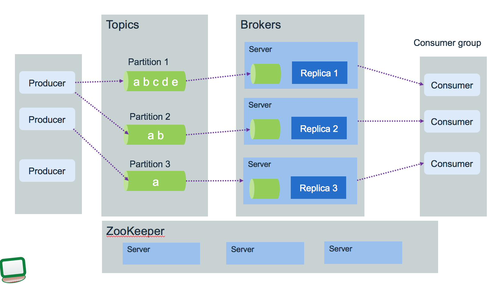
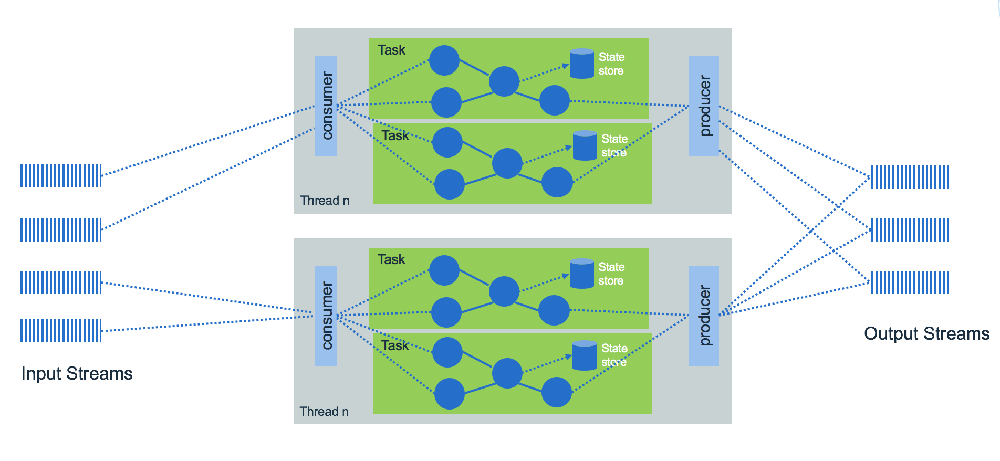

# Apache Kafka

In this article I am presenting real time event processing and analytics using **Kafka** deployed on Kubernetes cluster. We are documenting how to deploy this capability on IBM Cloud Private using a [**Kafka**](https://Kafka.apache.org/) open source distribution or the new [IBM Event Streams product](https://developer.ibm.com/messaging/event-streams/) and how to remote connect from hosts outside of the cluster, how to support high availability...

Update 10/2018 - *Author: [Jerome Boyer](https://www.linkedin.com/in/jeromeboyer/)*  

## Table of contents
* [Introduction - concepts - use cases](#introduction)
* [Details](#kafka-stream-details)
* [Architecture](#architecture)
* [Deployment](#deployment)
  * [Kafka on IBM Cloud Private](#install-zookeeper-kafka-on-icp)
  * [IBM Event Streams on IBM Cloud Private](./ibm-event-streams.md)
* [Monitoring with Prometheus and Grafana](./monitoring.md)
* [Compendium](#compendium)


## Introduction
[Kafka](https://Kafka.apache.org/) is a distributed streaming platform with the following key capabilities:
* Publish and subscribe streams of records.
* Atomic broadcast, send a record once, every subscriber gets it once.
* Store streams of data records on disk and replicate within the cluster for fault-tolerance.
* built on top of the ZooKeeper synchronization service to keep topic, partitions and offsets states high available.

### Key concepts
* **Kafka** runs as a cluster of one or more **broker** servers that can, in theory, span multiple data centers.
* The **Kafka** cluster stores streams of records in **topics**. Topic is referenced by producer to send data too, and subscribed by consumers.
* Each broker may have zero or more partitions per topic.
* Each partition is an ordered immutable sequence of records, that are persisted for a long time period.

The diagram below presents the key components:

 

 The **Kafka** brokers are allocated on three servers, with three data replicas. Topics represent end points to put or get records to, and partitions are used by producer and consumers and data replication. Zookeeper is used to persist the component and platform states and it runs in cluster to ensure high availability. One zookeeper server is the leader and other are used in backup.

* Each record consists of a key, a value, and a timestamp.
* Producers publish data records to topic and consumers subscribe to topics. When a record is produced without specifying a partition, a partition will be chosen using a hash of the key. If the record did not provide a timestamp, the producer will stamp the record with its current time (creation time or log append time). Producers hold a pool of buffer to keep records not yet transmitted to the server.
* Each partition is replicated across a configurable number of servers for fault tolerance. The number of partition will depend on characteristics like the number of consumer, the traffic pattern...
* Each partitioned message has a unique sequence id called **offset** ("abcde, ab, a ..." in the figure above are offsets).
* When a consumer reads a topic, it actually reads data from all of the partitions. As a consumer reads data from a partition, it advances its offset.
* Offsets are maintained in Zookeeper or in **Kafka**, so consumers can read next message (or from a specific offset) correctly even during broker server outrages. We are detailing this in the asset consumer implementation in [this repository](https://github.com/ibm-cloud-architecture/refarch-asset-analytics/tree/master/asset-consumer).
* **Kafka** uses topics with a pub/sub combined with queue model: it uses the concept of consumer group to divide the processing over a collection of consumer processes, running in parallel, and message can be broadcasted to multiple groups.
* Stream processing is helpful for handling out-of-order data, *reprocessing* input as code changes, and performing stateful computations. It uses producer / consumer, stateful storage and consumer groups. It treats both past and future data the same way.
* Consumer performs asynchronous pull to the connected broker via the subscription to a topic.

The figure below illustrates one topic having multiple partitions, replicated within the broker cluster:
  


###  Use cases
The typical use cases where **Kafka** helps are:
* Aggregation of event coming from multiple producers.
* Monitor distributed applications to produce centralized feed of operational data.
* Logs collector from multiple services
* Manage loosely coupled communication between microservices. (See [this note](https://github.com/ibm-cloud-architecture/refarch-integration/blob/master/docs/service-mesh.md#asynchronous-loosely-coupled-solution-using-events) I present a way to support a service mesh solution using asynchronous event)


## Kafka Stream Details
I recommend reading this excellent introduction from Jay Kreps @confluent: [Kafka stream made simple](https://www.confluent.io/blog/introducing-kafka-streams-stream-processing-made-simple/) to get familiar of why Kafka stream.

**Kafka** Stream has the following capabilities:
* embedded library for your application to use.
* integrates tables of state with streams of events.
* consumes continuous real time flow of records and publish new flow.
* supports exactly-once processing semantics to guarantee that each record will be processed once and only once even when there is a failure.
* Stream APIs transform, aggregate and enrich data, per record with milli second latency, from one topic to another one.
* supports stateful and windowing operations by processing one record at a time.
* can be integrated in java application and microservice. No need for separate processing cluster. It is a Java API. Stream app is done outside of the broker code!.
* Elastic, highly scalable, fault tolerance, it can recover from failure.
* Deployed as container to Kubernetes or other orchestration platform, with some clear understanding of the impact.

**Kafka** stream should be your future platform for asynchronous communication between your microservices to simplify interdependencies between them. (We are covering this pattern in [this service mesh article.](https://github.com/ibm-cloud-architecture/refarch-integration/blob/master/docs/service-mesh.md))

## Architecture



* **Kafka** Streams partitions data for processing it. Partition enables data locality, elasticity, scalability, high performance, parallelism, and fault tolerance.
* The keys of data records determine the partitioning of data in both **Kafka** and **Kafka Streams**.
* An application's processor topology is scaled by breaking it into multiple tasks.
* Tasks can then instantiate their own processor topology based on the assigned partitions.

See [this article from Confluent](https://docs.confluent.io/current/streams/architecture.html) for deeper architecture presentation.

When you want to deploy solution that spreads over multiple regions to support global streaming, you need to address challenges like:
* How do you make data available to applications across multiple data centers?
* How to serve data closer to the geography?
* How to be compliant on regulations, like GDPR?
* How to address no duplication of records?

### Solution considerations
There are a set of design considerations to assess for each **Kafka** solution:
#### Topics
Performance is more a function of number of partitions than topics. Expect that each topic has at least one partition. When considering latency you should aim for limiting to hundreds of topic-partition per broker node.

The approach to use one topic per data type is natural and will work, but when addressing microservice to microservice communication it is less relevant to use this pattern.
The important requirement to consider is the sequencing or event order. When event order is very important then use a unique partition, and use the entity unique identifier as key. Ordering is not preserved across partitions.

When dealing with entity, independent entities may be in separate topics, when strongly related one may stay together.

With **Kafka** stream, state store or KTable, you should separate the changelog topic from the others.

#### Producer
When developing a record producer you need to assess the following:
* what is the expected throughput to send events? Event size * average throughput combined with the expected latency help to compute buffer size.
* can the producer batch events together to send them in batch over one send operation?
* is there a risk for loosing communication? Tune the RETRIES_CONFIG and buffer size
* assess *once to exactly once* delivery requirement. Look at idempotent producer.

See related discussion [ on confluent web site](https://www.confluent.io/blog/put-several-event-types-kafka-topic/)

#### Consumer
From the consumer point of view a set of items need to be addressed during design phase:
* do you need to group consumers for parallel consumption of events?
* what is the processing done once the record is processed out of the topic? And how a record is supposed to be consumed?.
* how to persist consumer committed position? (the last offset that has been stored securely)
* assess if offsets need to be persisted outside of Kafka?. From version 0.9 offset management is more efficient, and synchronous or asynchronous operations can be done from the consumer code. We have started some Java code example in [this project](https://github.com/ibm-cloud-architecture/refarch-asset-analytics/tree/master/asset-consumer)
* does record time sensitive, and it is possible that consumers fall behind, so when a consumer restarts he can bypass missed records?
* do the consumer needs to perform joins, aggregations between multiple partitions?


### High Availability in the context of Kubernetes deployment

For any Kubernetes deployment real high availability is constrained by the application / workload deployed on it. The Kubernetes platform supports high availability by having at least the following configuration:
* At least three master nodes (always a odd number). One is active at master, the others are in standby.
* Three proxy nodes.
* At least three worker nodes, but with zookeeper and Kafka clusters need to move to 6 nodes as we do not want to have zookeeper nodes with Kafka cluster broker on the same host.
* Externalize the management stack to three manager nodes
* Shared storage outside of the cluster to support private image registry, audit logs
* Use `etcd` cluster: See recommendations [from this article](https://github.com/coreos/etcd/blob/master/Documentation/op-guide/clustering.md). The virtual IP manager assigns virtual IP address to master and proxy nodes and monitors the health of the cluster. It leverages `etcd` for storing information, so it is important that `etcd` is high available too.  

For IBM Cloud private HA installation see the [product documentation](https://www.ibm.com/support/knowledgecenter/en/SSBS6K_2.1.0.3/installing/custom_install.html#HA)

Traditionally disaster recovery and high availability were always consider separated subjects. Now active/active deployment where workloads are deployed in different data center, are more a common request. IBM Cloud Private is supporting [federation cross data centers](https://github.com/ibm-cloud-architecture/refarch-privatecloud/blob/master/Resiliency/Federating_ICP_clusters.md), but you need to ensure to have low latency network connections. Also not all deployment components of a solution are well suited for cross data center clustering.

For **Kafka** context, the *Confluent* web site presents an interesting article for [**Kafka** production deployment](https://docs.confluent.io/current/kafka/deployment.html). One of their recommendation is to avoid cluster that spans multiple data centers and specially long distance ones.
But the semantic of the event processing may authorize some adaptations. For sure you need multiple Kafka Brokers, which will connect to the same ZooKeeper ensemble running at least five nodes (you can tolerate the loss of one server during the planned maintenance of another). One Zookeeper server acts as a lead and the two others as stand-by.

This schema above illustrates the recommendation to separate Zookeeper from **Kafka** nodes for failover purpose as zookeeper keeps state of the **Kafka** cluster. We use Kubernetes [anti-affinity](https://kubernetes.io/docs/concepts/configuration/assign-pod-node/#affinity-and-anti-affinity) to ensure they are scheduled onto separate worker nodes that the ones used by zookeeper. It uses the labels on pods with a rule like: **Kafka** pod should not run on same node as zookeeper pods.  Here is an example of such spec:
```yaml
apiVersion: v1
kind: Pod
metadata:
  name: with-pod-affinity
spec:
  affinity:
    podAntiAffinity:
          requiredDuringSchedulingIgnoredDuringExecution:
            labelSelector:
            matchExpressions:
            - key: name
              operator: In
              values:
              - gc-zookeeper
          topologyKey: kubernetes.io/hostname
```
We recommend doing the [running zookeeper in k8s tutorial](https://kubernetes.io/docs/tutorials/stateful-application/zookeeper) for understanding such configuration.
Provision a **fast storage class** for persistence volume.

**Kafka** uses the log.dirs property to configure the driver to persist logs. So you need to define multiple volumes/ drives to support log.dirs.

Zookeeper should not be used by other application deployed in k8s cluster, it has to be dedicated for one **Kafka** cluster only..

In a multi-cluster configuration being used for disaster recovery purposes, messages sent between clusters will have different offsets in the two clusters. It is usual to use timestamps for position information when restarting applications for recovery after a disaster. We are addressing offset management in the consumer project [here]().

For configuring ICP for HA on VmWare read [this note](https://github.com/ibm-cloud-architecture/refarch-privatecloud/blob/master/Configuring_ICP_for_HA_on_VMware.md).

For **Kafka** streaming with stateful processing like joins, event aggregation and correlation coming from multiple partitions, it is not easy to achieve high availability cross clusters: in the strictest case every event must be processed by the streaming service exactly once. Which means:
* producer emit data to different sites and be able to re-emit in case of failure. Brokers are known by producer via a list of hostname and port number.
* communications between zookeeper and cluster node are redundant and safe for data losses
* consumer ensures idempotence... They have to tolerate data duplication and manage data integrity in their persistence layer.

Within Kafka's boundary, data will not be lost, when doing proper configuration, also to support high availability the complexity moves to the producer and the consumer implementation.

**Kafka** configuration is an art and you need to tune the parameters by use case:
* partition replication for at least 3 replicas. Recall that in case of node failure,  coordination of partition re-assignments is provided with ZooKeeper.
* end to end latency needs to be measured from producer (when a message is sent) to consumer when it is read. A consumer is able to get a message when the broker finishes to replicate to all in-synch replicas.
* use the producer buffering capability to pace the message to the broker. Can use memory or time based threshold.
* Define the number of partitions to drive consumer parallelism. More consumers running in parallel the higher is the throughput.
* Assess the retention hours to control when old messages in topic can be deleted
* Control the maximum message size the server can receive.    

Zookeeper is not CPU intensive and each server should have a least 2 GB of heap space and 4GB reserved. Two cpu per server should be sufficient. Servers keep their entire state machine in memory, and write every mutation to a durable WAL (Write Ahead Log) on persistent storage. To prevent the WAL from growing without bound, ZooKeeper servers periodically snapshot their in memory state to storage. Use fast and dynamically provisioned persistence storage for both WAL and snapshot.

## Deployment
### Run **Kafka** in Docker On Linux
If you run on a linux operating system, you can use the [Spotify **Kafka** image](https://hub.docker.com/r/spotify/kafka/) from dockerhub as it includes Zookeeper and **Kafka** in a single image.

It is started in background (-d), named "**Kafka**" and mounting scripts folder to /scripts
```
docker run -d -p 2181:2181 -p 9092:9092 -v `pwd`:/scripts --env ADVERTISED_HOST=`docker-machine ip \`docker-machine active\`` --name kafka --env ADVERTISED_PORT=9092 spotify/kafka
```

Then remote connect to the docker container to open a bash shell:
```
docker exec  -ti kafka/bin/bash
```

Create a topic: it uses zookeeper as a backend to persist partition within the topic. In this deployment zookeeper and **Kafka** are running on the localhost inside the container. So port 2181 is the client port for zookeeper.

```
cd /opt/kafka/bin
./kafka-topics.sh --create --zookeeper localhost:2181 --replication-factor 1 --partitions 1 --topic mytopic
./kafka-topics.sh --list --zookeeper localhost:2181
```
We have done shell scripts for you to do those command and test your local **Kafka**. The scripts are under `../scripts/kafka`
* createtopic.sh
* listtopic.sh
* sendText.sh  Send a multiple lines message on mytopic topic- open this one in one terminal.
* consumeMessage.sh  Connect to the topic to get messages. and this second in another terminal.

### Run Kafka On MacOS with Docker
Go to the `scripts/kafka` folder and start a 4 docker containers solution with Kafka, ZooKeeper, REST api, and schema registry using `docker-compose up` command. The images are from [confluent](https://github.com/confluentinc/)
```
REPOSITORY                         TAG                 IMAGE ID            CREATED             SIZE
confluentinc/cp-schema-registry    latest              31837a7d646d        6 days ago          673MB
confluentinc/cp-Kafka-rest         latest              4b878c9e48f0        6 days ago          663MB
confluentinc/cp-Kafka              latest              c3a2f8363de5        6 days ago          562MB
confluentinc/cp-zookeeper          latest              18b57832a1e2        6 days ago          562MB
```

### On MacOS with Docker Edge and Kubernetes
This deployment is for development purpose and it is using the last Docker Edge version which includes Kubernetes simple cluster.

The folder scripts/kafka includes a set of yaml files to configure zookeeper and Kafka:
```
cd scripts/kafka
# Create the zookeeper single node (one replica) exposing port 2181
kubectl create -f zookeeper-deployment.yaml
# expose zookeeper with a nodeport service on port 30181 mapped to docker image port 2181
kubectl create -f zookeeper-service.yaml
```
Modify the Kafka deployment yaml file to change the IP addresses set with your ip address.
```
- name: KAFKA_ADVERTISED_HOST_NAME
         value: "192.168.1.89"
- name: KAFKA_ZOOKEEPER_CONNECT
         value: 192.168.1.89:30181
```
Then create the Kafka deployment:
```
$ kubectl create -f deployments/kafka/dev/kafka-deployment.yaml
# and the service to export a nodeport 30092
$ kubectl create -f deployments/kafka/dev/kafka-service.yaml
```

So now we can test with a tool like: [kafkacat](https://docs.confluent.io/current/app-development/kafkacat-usage.html), that you can install with `brew install kafkacat`. To consume message use a terminal window and listen to the `test-topic` with `kafkacat -C -b 192.168.1.89:30092 -t test-topic`. To produce text message use a command like:
```
 echo "I'm a super interesting message" | kafkacat -P -b 192.168.1.89:30092 -t test-topic
```
It is important to note as of current version kafkacat may timeout as the timout is set to 5s. The only way to avoid that is to clone the github and change in https://github.com/edenhill/kafkacat/blob/debian/1.3.1-1/kafkacat.c line 640 the condition from 5000 to 30000.

To work on topic, connect to the kafka container and use the same tools as before but specify the zookeeper running in a separate container.
```
docker exec -ti <kafka-container-id> bash
bash-4.4# cd /opt/kafka/bin
bash-4.4# ./kafka-topics.sh --list --zookeeper 192.168.1.89:30181
 ./kafka-topics.sh --create --replication-factor 1 --partitions 1 --topic streams-wordcount-output --zookeeper 192.168.1.89:30181
```

**Kafka** web site has an interesting use case to count words within a text, we will detail that in [this section](#example-to-run-the-word-count-application:).

We are also detailing a full solution including Event producer, consumer and persistence to Cassandra in [this repository](https://github.com/ibm-cloud-architecture/refarch-asset-analytics)

## Install Zookeeper Kafka on ICP
There are two options: use our manifests for Kafka and zookeeper and even our zookeeper docker image, or use [IBM Event Streams](https://developer.ibm.com/messaging/event-streams/) if you are using ICP 3.1.x.

### Considerations
One major requirement to address which impacts kubernetes Kafka Services configuration and Kafka Broker server configuration is the need for remote access or not: meaning do we need to have applications not deployed on Kubernetes that should push or consume message to/from topics defined in the Kafka Brokers running in pods. Normally the answer should be yes as all deployments are Hybrid cloud per nature.
As the current client API is doing its own load balancing between brokers we will not be able to use ingress or dynamic node port allocation.

Let explain by starting to review Java code to access brokers. The properties needed to access
```java
public static String BOOTSTRAP_SERVERS = "172.16.40.133:32224,172.16.40.137:32224,172.16.40.135:32224";
Properties properties = new Properties();
properties.put(ProducerConfig.BOOTSTRAP_SERVERS_CONFIG, BOOTSTRAP_SERVERS);
kafkaProducer = new KafkaProducer<>(properties);
....

```

To connect to broker  their addresses and port numbers need to be specified. This information should come from external properties file, but the code above is for illustration. The problem is that once deployed in Kubernetes,  Kafka broker runs as pod so have dynamic port number if we expose a service using NodePort, and the IP address may change overtime while pod are scheduled to Node. The list broker need to be in the format: <host>:<port>, <host>:<port>,<host>:<port>. So host list, without port number will not work, forbidden the use of virtual host name defined with Ingress manifest and managed by Kubernetes ingress proxy. An external load balancer will not work too.
Here is an example of return message when the broker list is not set right: `Connection to node -1 could not be established. Broker may not be available`.

There are two options to support remote connection: implement a proxy, deployed inside the Kubernetes cluster, with 3 or 5 hostnames and port to expose the brokers, or use static NodePort. As of now for development we used NodePort:
```yaml
apiVersion: v1
kind: Service
metadata:
  labels:
    app: gc-kafka
  name: gc-kafka-svc
spec:
  type: NodePort
  ports:
  - name: kafka-port
    port: 32224
    nodePort: 32224
    targetPort: 32224
  selector:
    app: gc-kafka
```
So we use a port number for internal and external communication. In statefulset we use a google created tool to start the kafka server and set parameters to override the default the `conf/server.properties`.
```
command:
- "exec kafka-server-start.sh /opt/kafka/config/server.properties --override broker.id=${HOSTNAME##*-} \
  --override listeners=PLAINTEXT://:32224 \
```

When consumer or producer connect to a broker in the list there are some messages exchanged, like getting the cluster ID and the endpoint to be used which corresponds to a virtual DNS name of the exposed service:
`gc-kafka-0.gc-kafka-hl-svc.greencompute.svc.cluster.local`:

```
INFO  org.apache.kafka.clients.Metadata - Cluster ID: 4qlnD1e-S8ONpOkIOGE8mg
INFO  o.a.k.c.c.i.AbstractCoordinator - [Consumer clientId=consumer-1, groupId=b6e69280-aa7f-47d2-95f5-f69a8f86b967] Discovered group coordinator gc-kafka-0.gc-kafka-hl-svc.greencompute.svc.cluster.local:32224 (id: 2147483647 rack: null)

```
So the code may not have this entry defined in the DNS. I used /etc/hosts to map it to K8s Proxy IP address. Also the port number return is the one specified in the server configuration, it has to be one Kubernetes and Calico set in the accepted range and exposed on each host of the cluster. With that connection can be established.


### Using existing manifests
We are defining two types of manifests, one set for development environment and one for production. The manifests and scripts are under deployments folder of this project.

The docker images used for Kafka is  `gcr.io/google_samples/k8sKafka:v1` and for zookeeper `ibmcase/zookeeper`, an alternate is to use [Kubernetes zookeeper K8SZK](https://github.com/kubernetes/contrib/tree/master/statefulsets/zookeeper)

#### ZooKeeper
Development deployment uses one zookeeper server. For production the replicas is set to 5 to tolerate one planned and one unplanned failure. The service defines 3 ports: one for the inter-server communication, one for client access and one for leader-election.
Persistence volumes are needed to provide durable storage. Better to use network storage like NFS or glusterfs.

Use the script `deployZookeeper.sh`, under deployments/zookeeper, which creates volume, services and deployment or statefulset. When running in production it is better to use separate zookeeper ensemble for each **Kafka** cluster. Each server should have at least 2 GiB of heap with at least 4 GiB of reserved memory

To validate verify the pods are up and running:
```
$ kubectl get pods -o wide

```

#### Kafka
The manifests and scripts are under `deployments/kafka`. The `deployKafka.sh` script configures volume, service and statefulset.

#### Verify deployment
We can use the tools delivered with Kafka by using the very helpful `kubectl exec` command.

* Remote connect to the Kafka pod:
```
kubectl exec -ti gc-Kafka-0 bash
```
* Create a test-topic while connected to the Kafka broker: gc-Kafka-0
```
Kafka@gc-Kafka-0:/$ Kafka-topics.sh --create --replication-factor 1 --partitions 1 --topic test-topic --zookeeper gc-srv-zookeeper-svc.greencompute.svc.cluster.local:2181
```
The zookeeper was exposed via a kubernetes NodePort service.

* Get IP address and port number for Zookeeper
```
$ kubectl describe svc gc-client-zookeeper-svc
Name:                     gc-client-zookeeper-svc
Namespace:                greencompute
Type:                     NodePort
IP:                       10.10.10.52
Port:                     client  2181/TCP
TargetPort:               2181/TCP
NodePort:                 client  31454/TCP
Endpoints:                192.168.223.43:2181
```
* Validate the list of topics from the developer's workstation using the command:
```
$ kubectl exec -ti gc-Kafka-0 -- bash -c "Kafka-topics.sh --list --zookeeper gc-srv-zookeeper-svc.greencompute.svc.cluster.local:2181 "

or
Kafka-topics.sh --describe --topic test-topic --zookeeper gc-srv-zookeeper-svc.greencompute.svc.cluster.local:2181

```
* start the consumer from the developer's workstation
```
$ kubectl get pods | grep gc-Kafka
$ kubectl exec gc-Kafka-0 -- bash -c "Kafka-console-consumer.sh --bootstrap-server  localhost:9093 --topic test-topic --from-beginning"
```
the script `deployment/Kafka/consumetext.sh` executes those commands. As we run in the Kafka broker the host is localhost and the port number is the headless service one.

* start a text producer
Using the same approach we can use broker tool:
```
$ kubectl exec gc-Kafka-0 -- bash -c "/opt/Kafka/bin/Kafka-console-producer.sh --broker-list localhost:9093 --topic test-topic << EOB
this is a message for you and this one too but this one...
I m not sure
EOB"
```
Next steps... do pub/sub message using remote IP and port from remote server. The code is in [this project]().

### Install IBM Event Streams on ICP
[See this separate article](./ibm-event-streams.md)

### Troubleshooting
For ICP troubleshooting see this centralized [note](https://github.com/ibm-cloud-architecture/refarch-integration/blob/master/docs/icp/troubleshooting.md)

#### Assess the list of Topics
```
# remote connect to the Kafka pod and open a bash:
$ kubectl exec -ti Kafka-786975b994-9m8n2 bash
bash-4.4# ./Kafka-topics.sh  --zookeeper 192.168.1.89:30181 --list
```
Purge a topic with bad message: delete and recreate it
```
./Kafka-topics.sh  --zookeeper 192.168.1.89:30181 --delete --topic test-topic
./Kafka-topics.sh  --zookeeper 192.168.1.89:30181 --create --replication-factor 1 --partitions 1 --topic test-topic
```
#### Timeout while sending message to topic
The error message may look like:
```
Error when sending message to topic test-topic with key: null, value: 12 bytes with error: (org.apache.Kafka.clients.producer.internals.ErrorLoggingCallback)
org.apache.Kafka.common.errors.TimeoutException: Failed to update metadata after 60000 ms.
```
This can be linked to a lot of different issues, but it is a communication problem. Assess the following:
* port number exposed match the broker's one.
* host name known by the server running the producer or consumer code.

## Streaming app
The Java code in the project: https://github.com/ibm-cloud-architecture/refarch-asset-analytics/tree/master/asset-event-producer includes examples of stateless consumers, a text producer, and some example of stateful operations. In general code for processing event does the following:
* Set a properties object to specify which brokers to connect to and what kind of serialization to use.
* Define a stream client: if you want stream of record use KStream, if you want a changelog with the last value of a given key use KTable (Example of using KTable is to keep a user profile with userid as key)
* Create a topology of input source and sink target and action to perform on the records
* Start the stream client to consume records

A stateful operator uses the streaming Domain Specific Language, and is used for aggregation, join and time window operators. Stateful transformations require a state store associated with the stream processor. The code below comes from Kafka examples and is counting word occurrence in text
```
    final StreamsBuilder builder = new StreamsBuilder();
    final Pattern pattern = Pattern.compile("\\W+");

    KStream<String, String> textLines = builder.stream(source);

    KTable<String, Long> wordCounts = textLines
       .flatMapValues(textLine -> Arrays.asList(pattern.split(textLine.toLowerCase())))
       .print(Printed.toSysOut()
       .groupBy((key, word) -> word)
       .count(Materialized.<String, Long, KeyValueStore<Bytes, byte[]>>as("counts-store"));
    wordCounts.toStream().to(sink, Produced.with(Serdes.String(), Serdes.Long()));

    KafkaStreams streams = new KafkaStreams(builder.build(), props);
    streams.start();
```
* [KStream](https://Kafka.apache.org/10/javadoc/org/apache/Kafka/streams/kstream/KStream.html) represents KeyValue records coming as event stream from the topic.
* flatMapValues() transforms the value of each record in "this" stream into zero or more values with the same key in the new KStream. So here the text line is split into words. The parameter is a [ValueMapper](https://Kafka.apache.org/10/javadoc/org/apache/Kafka/streams/kstream/ValueMapper.html) which applies transformation on values but keeping the key.
* groupBy() Group the records of this KStream on a new key that is selected using the provided KeyValueMapper. So here it create new KStream with the extracted word as key.
* count() counts the number of records in this stream by the grouped key. Materialized is an api to define a store to persist state. So here the state store is "counts-store".
* Produced defines how to provide the optional parameters when producing to new topics.
* KTable is an abstraction of a changelog stream from a primary-keyed table.


### Example to run the Word Count application:
1. Be sure to create the needed different topics once the Kafka broker is started (test-topic, streams-wordcount-output):
```
docker exec -ti Kafka /bin/bash
cd /scripts
./createtopics.sh
```

1. Start a terminal window and execute the command to be ready to send message.
```
$ docker exec -ti Kafka /bin/bash
# can use the /scripts/openProducer.sh or...
root> /opt/Kafka_2.11-0.10.1.0/bin/Kafka-console-producer.sh --broker-list localhost:9092 --topic streams-plaintext-input
```

1. Start another terminal to listen to the output topic:
```
$ docker exec -ti Kafka /bin/bash
# can use the /scripts/consumeWordCount.sh or...
root> /opt/Kafka_2.11-0.10.1.0/bin/Kafka-console-consumer.sh --bootstrap-server localhost:9092 --topic streams-wordcount-output --from-beginning --formatter Kafka.tools.DefaultMessageFormatter --property print.key=true --property print.value=true --property key.deserializer=org.apache.Kafka.common.serialization.StringDeserializer --property value.deserializer=org.apache.Kafka.common.serialization.LongDeserializer
```

1. Start the stream client to count word in the entered lines

```
mvn exec:java -Dexec.mainClass=ibm.cte.Kafka.play.WordCount
```

Outputs of the WordCount application is actually a continuous stream of updates, where each output record is an updated count of a single word. A KTable is counting the occurrence of word, and a KStream send the output message with updated count.


## Compendium

* [Start by reading Kafka introduction](https://Kafka.apache.org/intro/)
* [Another introduction from the main contributors: Confluent](http://www.confluent.io/blog/introducing-Kafka-streams-stream-processing-made-simple)
* [Develop Stream Application using Kafka](https://Kafka.apache.org/11/documentation/streams/)
* [Validating the Stream deployment](https://developer.ibm.com/messaging/event-streams/docs/validating-the-deployment/)
* [Kafka on Kubernetes using stateful sets](https://github.com/kubernetes/contrib/tree/master/statefulsets/Kafka)
* [IBM Event Streams product based on Kafka delivered in ICP catalog](https://developer.ibm.com/messaging/event-streams/)
* [IBM Developer works article](https://developer.ibm.com/messaging/event-streams/docs/learn-about-Kafka/)
* [Install Event Streams on ICP](https://developer.ibm.com/messaging/event-streams/docs/install-guide/)
* [Spark and Kafka with direct stream, and persistence considerations and best practices](http://aseigneurin.github.io/2016/05/07/spark-Kafka-achieving-zero-data-loss.html)
* [Example in scala for processing Tweets with Kafka Streams](https://www.madewithtea.com/processing-tweets-with-Kafka-streams.html)
