# Use Case: Short-term Data Analysis

Monday morning the boss comes in and asks: *Why were ads in taxis performing so poorly?*

Alice is a DBA at a company that places advertisements in taxis. They noticed lower success last quarter and are reconsidering their placements. Alice has been asked to look at what could explain this downturn and what actions can be taken.

We'll perform this exercise using taxi data from [a FOIA request](https://chriswhong.com/open-data/foil_nyc_taxi/) (but it looks like [NYC Gov](http://www.nyc.gov/html/tlc/html/about/trip_record_data.shtml) now directly supports this) and freely-downloaded [weather data](https://mesonet.agron.iastate.edu/request/download.phtml?network=NY_ASOS) ([specifically this set](https://mesonet.agron.iastate.edu/cgi-bin/request/asos.py?station=JFK&data=p01i&year1=2013&month1=1&day1=1&year2=2013&month2=12&day2=31&tz=Etc%2FUTC&format=comma&latlon=no&direct=no&report_type=1&report_type=2))

The specific external force to explore is how precipitation affects taxi ridership.

This scenario uses data freely available from the Internet. The idea is that internal data could also be used and enhanced with things like [Rich Weather Data](https://www.ibm.com/weather), [Social Media Analysis](https://www.ibm.com/us-en/marketplace/social-media-data-analysis), or other rich data sources.

It's likely Alice also looked at which concert venues were referenced on social media, trending terms in the news that might explain lower ridership (perhaps a taxi strike), metrics based on industries advertising in taxis, and many other data sources.

## Copying the Data

We'll be using a local copy of the data for this analysis. This allows us to perform simple transforms to better fit our intended usage. It also means our activity is not affecting production in any way once the data has been copied. We will use a feature provided by a product called IBM Data Server Manager (DSM) called Remote Tables. DSM provides the main interface to Db2 Warehouse in ICP. There is a [video for this process](https://www.ibm.com/developerworks/community/blogs/bed0acad-d142-4bd6-84b5-c136c4673ddc/entry/Accessing_Remote_Tables_with_DB2_and_DSM_to_create_a_Virtual_Warehouse?lang=en).

Our first step is to create a connection to the remote data source from within the Db2 Warehouse dashboard. Select the Remote Tables menu item to arrive at a screen like this:

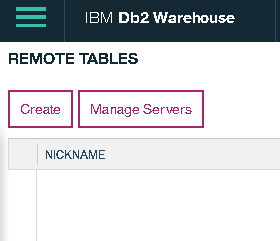

When you click "Create" you get a screen like this to Manage Remote Servers:

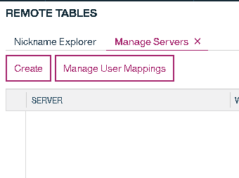

Clicking "Create" again takes you to the "Create Server" dialog:

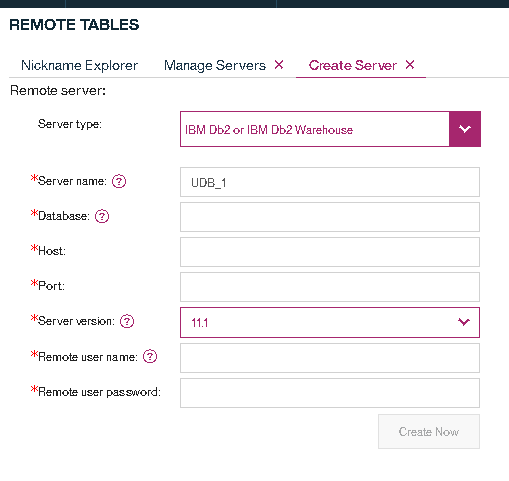

Fill in all the details. The server name is used to reference this information later, I used PRODDB2 for this document. Once the information is entered you can select "Create Now". This may require you to move your cursor out of the Remote user password box before it can be clicked. You'll receive a success message if successful.

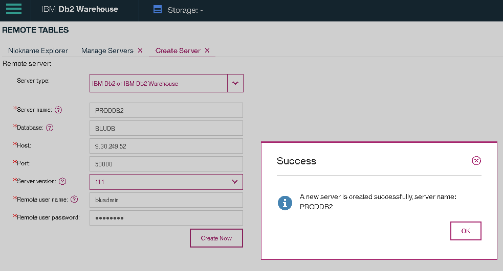

If not you will need to troubleshoot based on the error received (this feature is also called "federation" and the most common failure is needing to [use SSL](https://www.ibm.com/support/knowledgecenter/en/SSEPGG_11.1.0/com.ibm.db2.luw.admin.sec.doc/doc/t0070301.html) which requires additional setup not covered here).

## Defining the Remote Tables

Closing some of the tabs by clicking the X next to "Create Server" and "Manage Server" (or clicking back on "Nickname Explorer") will get you back to that original create button so we can add a Nickname. I have already selected the PRODDB2 server that was just defined.

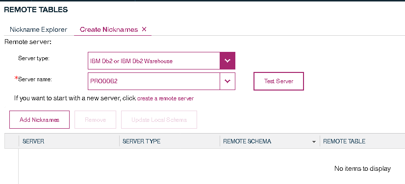

Click "Add Nicknames" to bring up a list of tables on the remote server. They can be filtered to more esily find tables of interest. At the bottom of the page in the screenshot above is a link to show the script, which can be helpful if many remote tables requiring different filters are needed.

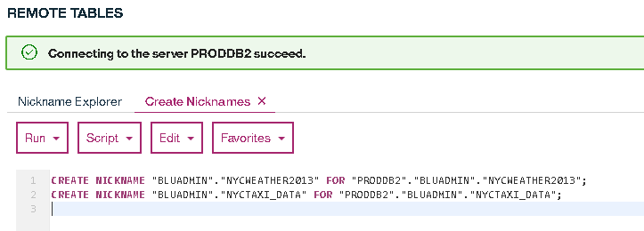

I am pulling the taxi ride data from my remote data source. The weather data being used is small enough that it could be uploaded through the "Load Data" menu. Upload speed is limited by the bandwidth between the client providing the file and ICP which in my case is lower than the bandwidth between my remote server and ICP.

Running the script results in the nicknames being created.

## Using the Remote Tables

Now that you have defined the tables you are able to use them just like regular tables. These tables can be joined with other tables in your database, updated, inserted into, etc (permissions on the remote server still apply). Every time you use them there is a connection (which gets reused a number of times) to the remote data source. Any translations into the remote dialect will happen automatically. There is effort made to minimize the amount of data requested from the remote source - filtering, choosing particular columns, and grouping can be "pushed down" and happen there rather than return the intermediate results to perform those actions locally.

The remote data has a row for every ride. Our analysis is just going to look at a daily rollup so we can add a ride_date column. I used the `CREATE TABLE ... AS` syntax to create a new table as the results of a query, copying no data into it yet:

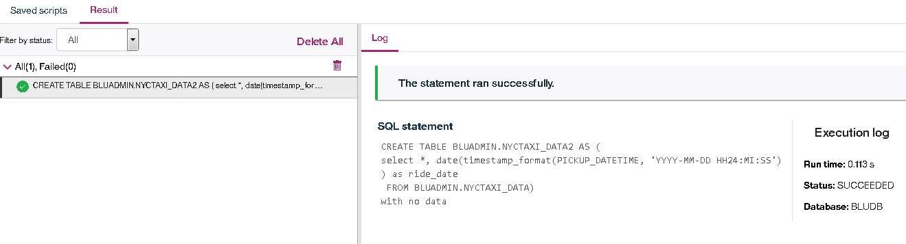

```
CREATE TABLE BLUADMIN.NYCTAXI_DATA2 AS (
select *, date(timestamp_format(PICKUP_DATETIME, 'YYYY-MM-DD HH24:MI:SS')) as ride_date
 FROM BLUADMIN.NYCTAXI_DATA)
with no data
;
```

It's important to note that this query is run against the nickname, will perform a simple transform on a column in the remote table, and results in a local table bing created.

The easiest (and fastest for large datasets) is to use a "LOAD FROM CURSOR" operation selecting from the nickname and replacing the data in the local table:

```
call sysproc.admin_cmd('LOAD FROM (select *, date(timestamp_format(PICKUP_DATETIME, ''YYYY-MM-DD HH24:MI:SS'')) as ride_date FROM BLUADMIN.NYCTAXI_DATA2) OF CURSOR REPLACE INTO BLUADMIN.NYCTAXI_DATA')
```

That SYSPROC.ADMIN_CMD stored procedure allows you to run many historically command-line activities as though they were SQL. In this case I'm using the LOAD utility and am able to use shorthand to define the source file as an SQL cursor.

While the load operation is running it can be monitored as an Application on the Utilities tab.

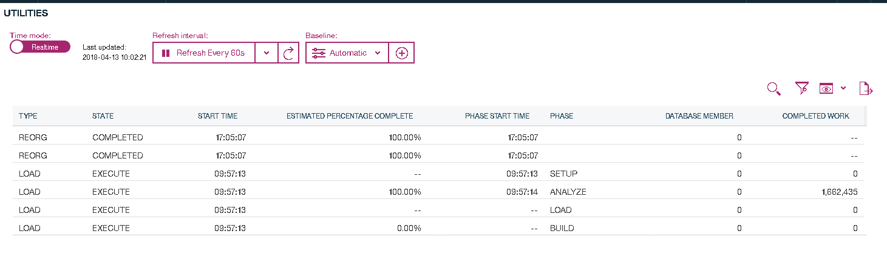

Now you have a copy of the data in a local table called BLUADMIN.NYCTAXI_DATA2.

## Loading From a File

The JFK weather station data was downloaded from the link above. The Load tab of the Db2 Warehouse interface has several options for loading data into the database. We'll use a file.

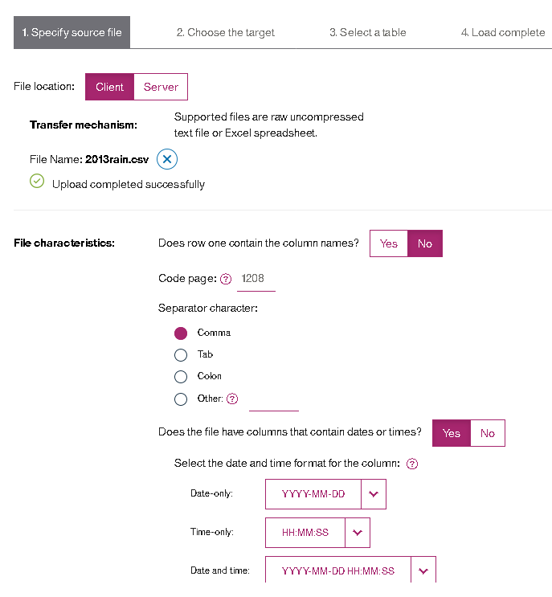

The file will be uploaded to a staging area. Answer the initial questions and the next page will preview the data.

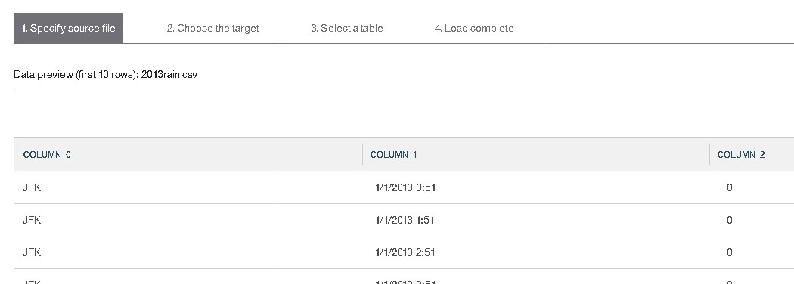

If the data is as expected you can move to the next page which will start defining the target. We'll create a new table.

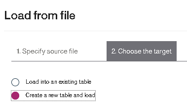

We have to define column names and data types.

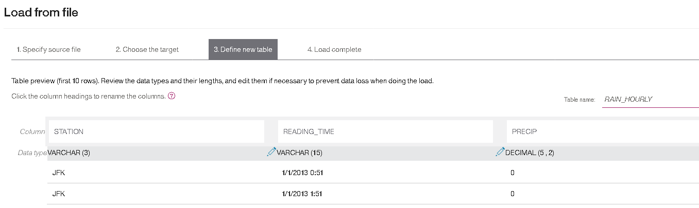

This load should run relatively quickly and present a load summary showing that all rows were loaded successfully.

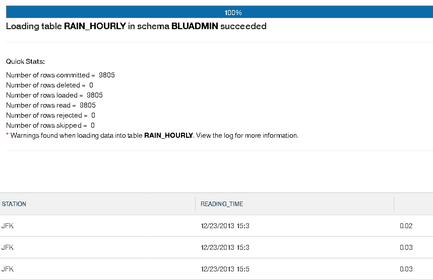

**Note**: We had warnings. These were because the READING_TIME columns was too short and some minutes were truncated.

## Making a Daily Precipitation Table

Earlier we summarized taxi data by day so we will do the same with our precipitation. The steps are similar. First we'll create the summary table using the query that will populate it later:

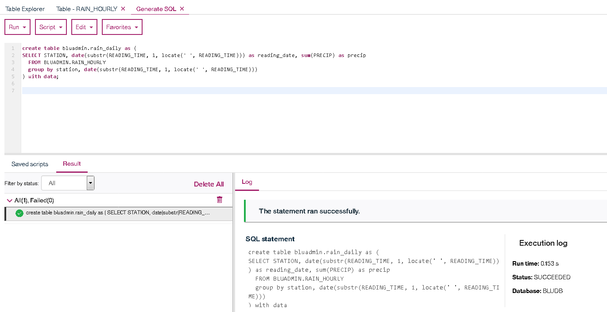

Then, because this is a faster query resulting in at most 366 rows we will simply populate the table by running it:
```
CREATE TABLE BLUADMIN.RAIN_DAILY AS (
SELECT STATION, date(substr(READING_TIME, 1, locate(' ', READING_TIME))) as reading_date, sum(PRECIP) as precip
  FROM BLUADMIN.RAIN_HOURLY
  group by station, date(substr(READING_TIME, 1, locate(' ', READING_TIME)))
) WITH DATA;
```

(Notice that previous we used `WITH NO DATA` which creates the table structure. This time we told it to also populate the table.

# Use the Data Science Experience to Visualize Data

Alice has some SQL skills and a lot of DBA skills but not much of a data science background. Following tutorials and Internet searches she is able to get her notebook to connect to the new data set, load the data, and generate simple graphs. Based on her initial analysis she is able to show that ridership changes with the amount of rainfall. Since there was lower than usual rainfall last quarter it makes sense that ridership would be low. She presents her findings to management who then decide to add weather data into their predictive modeling for future pricing and exposure predictions.

## Connect to the Database

We're using a simple notebook with Python.

```
import jaydebeapi
import pandas as pd

taxi_db = "BLUDB"
taxi_host = "172.16.40.223"
taxi_port = "32693"
taxi_user = "bluadmin"
taxi_pwd = "****"

connection_string = 'jdbc:db2://{!s}:{!s}/{!s}'.format(taxi_host, taxi_port, taxi_db)
conn = jaydebeapi.connect("com.ibm.db2.jcc.DB2Driver", connection_string, [taxi_user, taxi_pwd])

print("Connection made")
```
The above code makes a JDBC connection to our local data set. It also imports the pandas library for use later.

## Pull Data Into Local Objects

We'll use the JDBC connection to populate a local data frame object with data.
```
cursor = conn.cursor()
cursor.execute("SELECT RIDE_DATE, COUNT(DISTINCT MEDALLION) medallions, count(distinct vendor_id) vendors, "
  "count(*) trips, cast(sum(cast(trip_time_in_secs/60 as int)) as int) total_minutes, sum(trip_distance) distance, PRECIP "
"FROM BLUADMIN.NYCTAXI_DATA2 TD, BLUADMIN.RAIN_DAILY RD "
"WHERE TD.RIDE_DATE = RD.READING_DATE "
               " AND RIDE_DATE BETWEEN '2013-01-01' AND '2013-03-31'"
"GROUP BY RIDE_DATE, PRECIP "
              "ORDER BY RIDE_DATE")

columns = [desc[0] for desc in cursor.description]
df = pd.DataFrame(cursor.fetchall(), columns=columns)
df.tail()
```

The last line will print the last few rows of data so you can confirm the amount is as expected. The query populates one quarter (three months) of taxi rides and rainfall data.

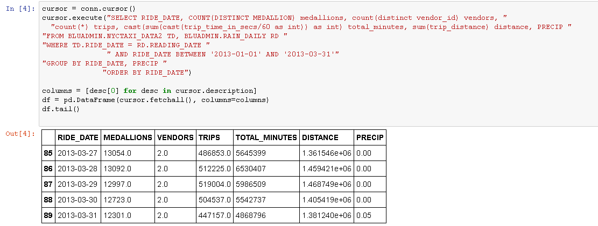

## Graph the Data

Now to create a simple graph. The data first gets normalized so the scale for the two lines will be the same. Then it is drawn.

```
import matplotlib as plt

%matplotlib inline


cols_to_norm = ['PRECIP', 'TRIPS', 'TOTAL_MINUTES']
df[cols_to_norm] = df[cols_to_norm].apply(lambda x: (x - x.min()) / (x.max() - x.min()))
# normal_df = (df-df.min())/(df.max()-df.min())

# df.plot.line(x="RIDE_DATE", y="PRECIP")
ax = df.PRECIP.plot(x="RIDE_DATE", style="b-")
ax.set_xlabel("Ride Date")
ax.set_ylabel("Rainfall")
ax2 = df.TRIPS.plot(x="RIDE_DATE", style="r-", secondary_y=True)
ax2.set_ylabel("Rides")
#ax3 = df.TOTAL_MINUTES.plot(x="RIDE_DATE", style="g-", secondary_y=True)
#ax3.set_ylabel("Minutes")
```

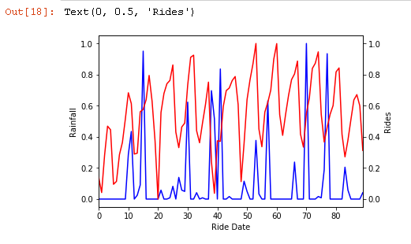


## Contributors
[Rob Wilson from IBM](https://www.linkedin.com/in/rob-wilson-3b34b8/)
