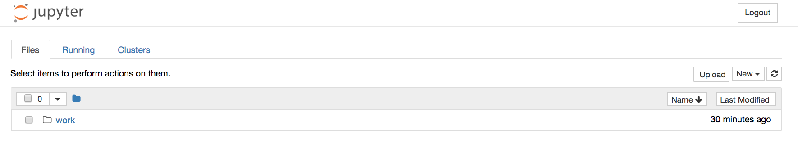

# Jupyter notebooks
This note presents some of the notebooks we have developed to run on Data Science Experiences on IBM Cloud Private.

The Jupyter Notebook is an open-source web application that allows you to create and share documents that contain live code, equations, visualizations and narrative text. http://jupyter.org.

As a quick summary: The notebook front end runs in web browser, the notebook server is responsible to delegate execution to kernels and to persist notebook as json file on the file system where the server is started.
For python the kernel is ipython. Here is a list of [available kernels](https://github.com/jupyter/jupyter/wiki/Jupyter-kernels)

## Notebooks
* [Customer churn analysis](./CustomerChurn/README.md)

## Best practices on using jupyter notebooks
Take into consideration where to start developing a notebook: locally or in DSX. You can start locally to draft your work and migrate to DSX as soon as you need to collaborate with other persons. When DSX local is deployed to a central cluster as IBM Cloud Private, you should start from DSX.

### Common notebook development best practices
* Do all imports in first code cell of your notebook.
* Start as early as possible, just out of a design thinking session. Keep the different draft version of your notebook in code repository
* Wrap cell content in function so they can be reused
* Use joblib for caching output of any function:
```
from sklearn.externals.joblib import Memory
memory = Memory(cachedir='/tmp', verbose=0)
@memory.cache
def afunction(p1, p2):
```
* Make cells loosely bound and avoid global variables.
* Use assertions to test code and validate results

### Local best practices
You can use virtual environment to do not impact you host/laptop environment. This is a problem on MACOS as python is used by the OS, so better to do not interfere too much on the default installation.
An alternate is to use a docker image.

#### use virtual environment, and install jupyter notebook in those env.
```
virtualenv -p /Library/Frameworks/Python.framework/Versions/3.4/bin/python3.4 .venv
# Activate environment
$ source .venv/bin/activate
$ python3 -m pip install jupyter
# Verify you are using the local one
$ which jupyter
```
* Create dependencies requirements once your notebook is valid.
```
pip freeze > requirememts.txt
```

#### Use a docker image
We are delivering a dockerfile in this project where you will be able to do some machine learning with jupyter, python, sklearn, tensorflow and spark. Build the image with the command:

```
$ docker build -t pysparktf .
$ docker images

REPOSITORY                                      TAG                 IMAGE ID            CREATED             SIZE
pysparktf                                       latest              ee5d45e40097        3 weeks ago         5.29GB
```
Yes it is a big image.

Start it with the `startJupyer.sh` script.
```
$ startJupyter.sh
[I 19:19:07.772 NotebookApp] The Jupyter Notebook is running at:
[I 19:19:07.772 NotebookApp] http://[all ip addresses on your system]:8888/?token=9d3ce417acd550966fdcf24c615b2f02799b0d5ea0ed208f
[I 19:19:07.772 NotebookApp] Use Control-C to stop this server and shut down all kernels (twice to skip confirmation).
[C 19:19:07.773 NotebookApp]

    Copy/paste this URL into your browser when you connect for the first time,
    to login with a token:
        http://localhost:8888/?token=9d3ce417acd550966fdcf24c615b2f02799b0d5ea0ed208f
```

It uses docker volume to share data between your host computer and the docker container/ The local folder `./jupyter-notebooks` is visible in the web application as the `work` folder.


