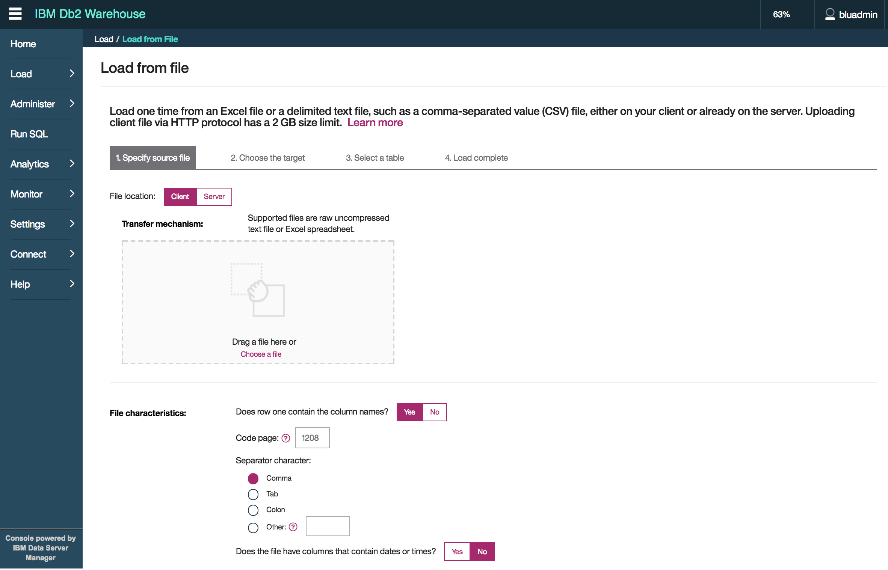

# Customer Churn Analysis
The notebooks in this folder are here to address one of the common use case for companies on competitive market like telecom providers: How to predict if a customer would churn?

They are based on the following source: https://github.com/IBMDataScience/DSX-DemoCenter/tree/master/predictCustomerChurn but we have tuned it to integrate to internal datasources and deliver more explanation for beginner data scientists or a software engineer who wants to understand what's going on.

Update 12/12/2107: Add two version of the notebook:
* CustomerChurnAnalysis.ipynb  with Db2 connection
* CustomerChurnAnalysisFromCSV.ipynb with data from csv files

## Pre-requisite
To run those notebooks on DSX on ICP you need to have:
* Have an ICP installed up and running: We have configured a 5 hosts topology.
* Define a namespace for ICP. We used the `greencompute` namespace.
* Deploy the DSX enterprise edition on ICP. See [this note](../../docs/ICP/README.md) on how to do that.
* Clone this repository.
* Create an instance of DB2 warehouse on ICP, see note [here](../../docs/db2warehouse/README.md) to understand how it is done.

## Step 1- Upload data to Db2 Warehouse.
From a pure Data Science experience, the customer data are defined in the `customer.csv` file in the folder: `notebooks/CustomerChurn/data_assets`. In this section we are loading the csv file in Db2 Warehouse. The steps are :
* Connect to the Db2 Warehouse admin console. The hostname / IP address is the ICP proxy server. In our case the IP is 172.16.40.131. The port number is specified during the deployment of the Db2 warehouse release within ICP. Executing the command `kubectl get services --namespace db2-warehouse` to see the port mapping. The exported port within the docker image 8443. The output: `8443:31107/TCP` maps it to 31107.

Once logged in you reach the main page as shown below:    


Select Load Data menu, and browse to the `customer.csv`.

Set the parameter, like the first row has the name of the columns...



The data are pre-loaded


You can adapt the column type, and then be sure to select create the table.


Once loaded you should have something very similar to the figure below:
  

## Step 2- Define Remote Data Source in DSX
To access the data from the remote database, you can use the data connector inside DSX. From the Project View, go to `Data Sources` menu and then click to `Add data source` link.


Specify name, Data source type, URL, userid and password of the DB2 user.
ATTENTION as we deployed Db2 warehouse on ICP, the exposed port number is not 50000 for HTTP, but the one mapped by ICP. To get information about the port mapping use the command: `kubectl get services --namespace db2-warehouse`:


At the bottom of the form add a data set, that is a reference to a table in the database: BLUADMIN.CUSTOMERLONG.


Once it is done, you can add the following type of code to jupyter notebook:
```python
import dsx_core_utils

dataSet = dsx_core_utils.get_remote_data_set_info('Customers')
dataSource = dsx_core_utils.get_data_source_info(dataSet['datasource'])

dbTableOrQuery = dataSet['schema'] + '.' + dataSet['table']

sparkSession = SparkSession(sc).builder.getOrCreate()
customers = sparkSession.read.format("jdbc").option("url", dataSource['URL']).option("dbtable",dbTableOrQuery).option("user",'BLUADMIN').option("password","changemeplease").load()
customers.show(5)
```


## Step 3- Load the customer churn analysis notebook in DSX
In the DSX console
1. go to the Projects view and create a new project. Specify a name (`CustomerChurnAnalysis`).
1. Select the FromFile and browse to the CustomerChurnAnalysis.ipynb file in this folder, then click `create`. As of now (12/2017) you will not see the file references or upload widget. Click on `create` to finalize the project creation.
1. In the project overview main page the Jupyter notebook should  be listed.  


## Step 4 - Execute the notebook step by Step
To run the notebook, double click on it and you should reach the Jupyter notebook web interface.  


The notebook has 2 types of cells - markdown (text) and code.
Each cell with code can be executed independently or together (see options under the Cell menu). When working in this notebook, we will be running one cell at a time because we need to make code changes to some of the cells.
To run the cell, position cursor in the code cell and click the Run (arrow) icon. The cell is running when you see the `*` next to it. Some cells have printable output.
Work through this notebook by reading the instructions and executing code cell by cell. Some cells will require modifications before you run them.

Note that not every cell has a visual output. The cell is still running if you see a `*` in the brackets next to the cell.

## Step 5 - Deploy the model as a spark
